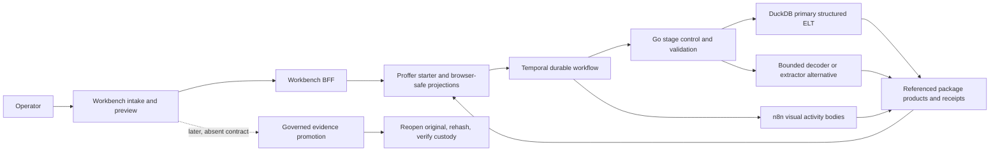

# Probata operator surface repair: implementation and gap receipt

**Date:** 2026-09-13

**Branch:** `codex/probata-surface-repair-20260913`

**Scope:** Workbench intake and Proffer preview surface, its browser-safe read projection, and focused contract tests.
**Proof boundary:** local source, API-contract, test, lint, and production-build proof. This receipt is not deployment or live-file execution proof.

## Result

The Workbench now projects one correlated Proffer operation into an operator surface with seven data views: Source, Records, Chunks/Context, Entities, Graph candidates, Workflow/receipts/errors, and DuckDB workspace. The server computes valid actions from the current Proffer phase and operation lifecycle. The browser no longer has to infer which recovery control is valid.

The surface exposes gaps instead of filling them with plausible-looking data. Package identity and hash, original fingerprint, context/evidence classification, promotion prerequisites, later rehash, custody state, Temporal IDs, and n8n execution/version/activation data remain unavailable because the current browser-safe engine contract does not return them. Exact-stage retry, checkpoint restart, cancel, stage skip, and derived repair execution remain omitted because there is no authenticated command and receipt contract for them.

D-158 is the governing storage split. Messaging keeps canonical message text in PostgreSQL and ordered membership in `working.content_chunk_message`. Non-messaging content may remain in the retained Intake Source Package or durable DuckDB-derived files; PostgreSQL holds control, identity, provenance, attempt, decision, coordinate, and receipt state without duplicating general content text. Governed context chunks publish to Weaviate only after operator approval. The current API does not return the source-type classification, selected destination, exact chunks, or publication receipt, so all four appear as unavailable or pending rather than guessed.

DuckDB is presented as the primary structured extraction and ELT path for compatible signatures. The embedded workspace is restricted to catalog tools containing `duckdb`. Go remains responsible for handler selection, invocation, bounded references and inputs, Temporal correlation, validation, retries, and repair decisions. The workspace does not provide arbitrary SQL and does not make DuckDB a second orchestrator or authority.

## Contract provenance and precedence

| Authority | Relevant contract | What governs this repair | Precedence |
|---|---|---|---|
| Owner direction recovered in `docs/reviews/2026-09-06-naming-and-rename-session-digest.md` (2026-09-03 discussion, especially the extraction-package and later-promotion ruling) | Context-first package: preserved original, metadata, attachments, parsed/extracted/normalized products, original hash and package hash; potential-evidence classification may occur during context intake; later promotion reopens and rehashes the original and establishes/verifies custody | The Source tab names each package and authority field, reports unavailable data truthfully, and separates context intake from later promotion | Highest product intent, amended by later rulings below |
| `docs/DECISION_LOG.md`, D-154 and D-158 | Immutable Intake Source Package plus source-type context storage: messaging text in PostgreSQL; non-messaging content in retained package or durable DuckDB-derived files; PostgreSQL control plane; approved context projection to Weaviate | D-158 is first in the operator contract list. Source tab shows classification, target, PG control state, and searchable projection separately | Newest governing package/storage ruling |
| `docs/DECISION_LOG.md`, D-149 | DuckDB is the registered handler wherever it can process a signature; decoders are retained bounded alternatives after logged failure | DuckDB is the primary structured ELT view. Handler choices come only from Proffer candidates | Newest named execution routing decision |
| `docs/DECISION_LOG.md`, D-152 | Get data normalized first; no custody hashing until later promotion | Context intake never claims H1/H2/H3 custody. Original/package fingerprints are shown as unavailable integrity fields; later custody remains a separate missing contract | Newest custody timing decision; supersedes custody-first language in D-123 and older stage labels |
| `docs/adr/0061-unified-operator-surface.md` (Accepted) | Workbench BFF, storage-free preview, no second authority, authenticated decision boundary, n8n/Temporal status and links only when returned | The BFF joins engine projections; the browser records decisions through existing routes; no canonical write or promotion occurs here | Accepted architecture over the older Proposed design spec |
| `docs/design/0061-unified-operator-surface/spec.md` (Proposed) | Earlier preflight and unified-screen design | Useful screen anatomy, but custody-first and preflight assumptions yield to accepted ADR and D-149/D-152 | Historical design input |
| `docs/PROJECT_CANON.md` | PostgreSQL and append-only receipts are authoritative; Workbench is a projection | UI labels the write boundary and never treats local component state as canonical | Repository-wide authority |
| `modules/engine/proffer/handler_selection.go`, `workflow.go`, `options.go`, `preview.go`, `types.go` | Executable handler paths, stages, waits, stage refs/receipts, preview phases, bounded options | Valid actions and current-stage detail are projected from these executable symbols | Executable truth for currently supported behavior |
| `modules/engine/parser/parser.go` and `modules/engine/normalize/normalize.go` | `RawRecordEnvelope` and `RecordEnvelope` v1 inner record contracts | Records continue through the existing preview/messages DTO. These are explicitly labeled inner contracts, not the complete extraction package | Nested executable data contracts |
| `modules/engine/temporal/activities.go`, `n8n_client.go`, `flowbinding.go` | n8n-backed activity bodies; bounded refs and scalar inputs; no payload transport | Workflow view reports the observed logical stage and receipt. It does not invent workflow, execution, activation, or version identifiers | Executable integration contract |
| Current tool-runtime repair capabilities | `repair.capabilities`, `repair.detect`, `repair.preview`, `repair.write-derived`, `repair.pdf-inspect`, `repair.pdf-derived`, `repair.flag-damaged`, `repair.quarantine-plan/copy`, `repair.audit-verify`; only write-derived/pdf-derived are approved derived writers | Source repair is a pre-router lane. Clean reports auto-resolve; only a concrete non-clean defect opens review. Tool/detector failure remains an operational error. Derived output never replaces the original | Executable repair-tool contract; the current preview DTO exposes only the assessment/source refs and review flag |
| `modules/engine/runtimeapi/proffer_preview.go` and `runtimeapi/previewmodel/model.go` | Browser-safe preview fields; deliberate omission of engine workflow/run IDs | Missing identities are explicit unavailability rows. Preview handle and request ID remain visible correlation coordinates | Executable browser boundary |
| Current owner direction in the 2026-09-13 repair task | Real files must use Proffer; no dead-end repair blocks; seven tabs; exact visibility; TEST/REAL isolation; n8n truth; bounded DuckDB actions | Defines the acceptance matrix below | Newest surface-specific ruling |

## Required positive flows and implementation matrix

| State or journey | Screen/tab | Visible evidence | Valid action | Backend contract | Expected transition | Proof |
|---|---|---|---|---|---|---|
| Choose a real local or registered R2 source | Intake / source inspection | Source name, declared format/size, location, preview checksum, acquisition reference, asserted context, selected TEST/REAL destination | Start context intake | Existing `POST /api/proffer/upload` or `/start`, carrying mode and real source bytes/ref | New preview handle and durable operation | Existing intake contract tests plus unchanged real Proffer start client |
| Operation starts | Preview / destination header and Workflow | Mode, matter ID, case ID, preview handle, request ID, source ref, lifecycle, current and active stage | Refresh; cancel appears only after a future authenticated cancel contract | `GET preview`, `GET operation`, new joined `GET operator?mode=` | Latest correlated projection | API tests reject mismatched mode and handle |
| Handler selection wait | Preview / Next valid actions | Recommendation ref through preview, compatible candidates, handler/version/path/compatibility ref | Select one returned candidate | Existing handler-decision route | Same operation resumes | UI calls existing decision function; action originates in server `valid_actions` |
| Repair decision wait | Source, Workflow, Next valid actions | Exact assessment ref, source-version ref, lifecycle/reason, stage receipt, pre-router ordering, and missing report/tool/profile/action fields | Retain the original; future apply-repair appears only when bounded repair IDs/inputs exist | Existing repair-decision route supports `apply_repair=false`; tool runtime allowlists write-derived/pdf-derived | Same operation resumes with authenticated override receipt | API/UI contract tests prove no fabricated repair tool and do not treat detector failure as damage |
| Structured extraction | DuckDB and Workflow | Selected `duckdb` execution path where returned, source/result refs, contract identities, stage status, receipt, attempt, errors | Inspect/query/filter/clean/validate/compare/export only when a matching monitored DuckDB catalog tool exists | Existing AtomicTools monitored catalog and calls; Proffer stage contracts | Tool action has its own monitored workflow/run receipt | Required-term filter prevents clearing search into unrelated tools |
| n8n-backed stage | Workflow | n8n layer, enclosing Proffer stage and receipt; execution ID/version/activation explicitly unavailable | Refresh only unless an actual deep link/action is later returned | Current Temporal n8n adapter returns `StageResult` refs, not n8n operational metadata | Projection advances when Proffer stage advances | Static contract and API layer tests |
| Records ready | Records | Raw and normalized generation IDs, message records, participants, attachment/source locators, required receipts | Load more; approve/reject only after correlated completeness gates | Existing messages route and decision route | Decision wait resolves | Existing provenance and receipt gates retained; record fields moved into tab component |
| Chunks, entities, graph candidates missing | Their named tabs | `unavailable` state and exact missing projection reason | None | No current browser-safe endpoints | No misleading transition | UI contract test requires all tabs and missing-data truth |
| Preview decision wait | Records and Next valid actions | Correlated messages/provenance, complete required receipts, exact mode and IDs | Approve or reject with reason | Existing preview-decision route | Same Proffer operation resumes or rejects | Browser keeps decision locked until exact data is loaded |
| Failed/unavailable/timed-out/rejected | Workflow and Next valid actions | Exact reason, failed stage, attempt-derived retry count, refs/receipt, unsupported controls with reasons | Start a new import; exact-stage retry/checkpoint restart are omitted until supported | No current retry/checkpoint command; intake can issue a new request | New request identity; old operation remains truthful | API test requires restart and missing-control reasons |
| Switch TEST/REAL | Global selector and preview destination | Different color/tone, explicit destination name, matter/case IDs, mode in URL and every API request | Navigate current mode; attach only a matching handle | Matter-mode registry and BFF mode validation | Component remounts on `mode:handle`; stale requests abort | Existing and new mode-isolation tests |
| Later evidence promotion | Source | Eligibility, prerequisites, rehash/re-extraction and custody rows all show unavailable reasons | None in this surface | Promotion package/custody API is absent | No automatic promotion | New package contract API tests |

## Forbidden behaviors

The implementation enforces these negative boundaries:

- No mock or decorative dashboard. Every available value comes from the joined preview/operation read models or configured mode identity.
- No second orchestrator or store. Workbench reads and commands; Temporal remains durable orchestration; Go owns routing and validation; PostgreSQL/receipts remain authority.
- No browser-only or manual substitute for processing. File starts still use the existing Proffer upload/start routes.
- No ad-hoc script or invented table. This change adds a read projection only.
- No parallel extraction DTO. The operator projection identifies and nests existing engine contracts; unavailable package fields remain unavailable.
- No hidden retry, repair, skip, cancel, write, or promotion. Unsupported controls are listed with reasons and have no buttons.
- No completion or activation claim without live proof. n8n version/activation/execution and Temporal IDs are unavailable.
- No TEST/REAL handle reuse. Mode is included in links, requests, event validation, and component identity; the BFF fails mismatched preview mode.
- No automatic promotion or intake-time custody claim.
- No unsupported UI action. Server-projected `valid_actions` controls rendering.
- No content payloads in Temporal/n8n operator metadata. The surface shows bounded references and receipts.
- No extraction/analysis conflation. Records are extraction products; graph candidates remain a downstream proposal lane.

## Branch-thinking matrix

| Hard flow | Alternative | Decision | Reason |
|---|---|---|---|
| Preview information architecture | Keep one long message view | Rejected | Hides package, workflow, missing projections, and non-message record types |
|  | Seven explicit tabs over one correlated snapshot | Selected | Matches distinct contracts and makes missing data visible without inventing it |
|  | Separate standalone applications per tab | Rejected | Creates navigation drift and risks a second authority boundary |
| Failure recovery | Always show every requested recovery button | Rejected | Creates unsafe dead controls and lies about backend support |
|  | Show only executable actions plus a missing-controls ledger | Selected | Provides a forward action when one exists and exact backend gaps when it does not |
|  | Hide the whole failure | Rejected | Recreates the reported no-visibility trap |
| Repair | Run a generic repair tool from the browser | Rejected | Current assessment returns no applicable tool ID or bounded input |
|  | Offer retain-original through the existing authenticated decision | Selected | This action exists and records the override against the exact assessment |
|  | Copy source to a browser-created repaired artifact | Rejected | Bypasses Proffer and preservation contracts |
| TEST/REAL switching | Reuse handle and merely recolor | Rejected | Allows stale cross-mode state and request leakage |
|  | Put mode in URL/API/event checks and remount on mode plus handle | Selected | Invalidates stale component state and lets the server fail closed |
|  | Duplicate the whole UI per mode | Rejected | Increases drift while preserving no stronger server fence |
| DuckDB tools | General AtomicTools catalog with editable search | Rejected | Operator could leave the DuckDB lane and run unrelated tools from the embedded panel |
|  | Catalog-backed tools filtered by required `duckdb` term | Selected | Reuses governed monitored actions and keeps the preview bounded |
|  | Arbitrary SQL editor | Rejected | Makes the browser a data authority and bypasses Go/Temporal validation |
| n8n visibility | Construct dashboard URLs from guessed IDs | Rejected | Current projection has no n8n workflow/execution/version/activation identity |
|  | Show enclosing stage/receipt and explicit identity gaps | Selected | Preserves visual-layer truth without invented links |

## Systems map

Control flows from the operator through authenticated BFF commands. Content remains behind references at orchestration boundaries. The preview reads projections; it does not own the package, records, graph, evidence decision, or custody state.

## Multi-perspective review and constructive dissent

| Perspective | Finding | Applied resolution |
|---|---|---|
| Operator/UX | A repair or failed stage without a route forward feels like a frozen application | Supported action panel is persistent; unsupported controls carry the exact missing contract |
| Frontend state | Mode changes and late network responses can repopulate the wrong preview | Mode-scoped component, generation counter, abort controllers, mode-bearing URL, mode-and-handle tab key |
| API contract | Joining preview and operation in the browser duplicates inference and can diverge | BFF creates one strict read projection and validates handle/mode correlation |
| Temporal+n8n | Logical stage names do not prove execution IDs, activation, or deployment health | Only stage/receipt truth is available; operational identities are explicitly unavailable |
| Extraction/data | Record envelope v1 is only an inner product, not the full package | Contract list puts the package/promotion ruling first and labels record contracts as inner |
| QA/accessibility | Color alone cannot convey TEST/REAL or availability | Text labels, badges, headings, roles, and exact IDs accompany color |
| Adversarial failure | A generic tool browser inside the DuckDB tab can escape its intended scope | `requiredToolTerm` applies a non-clearable catalog filter |
| Constructive dissent | “No dead end” could be interpreted as showing buttons even without commands | Rejected: a visible unavailable reason plus the only honest restart path is safer than a nonfunctional button. The missing backend command remains an explicit defect, not hidden UI scope |

## Pre-mortem and red-team findings

| Failure imagined before release | Cause | Detection/control in this change | Residual action |
|---|---|---|---|
| REAL operation opens under TEST and a decision targets the wrong matter | Stale handle survives mode switch | BFF compares preview mode; client validates mode on events; component remounts | Add mode directly to durable operation list projection so the ledger can filter before opening |
| Repair button silently runs the wrong generic tool | Assessment lacks tool ID/input contract | No apply-repair button; exact gap displayed | Extend engine assessment and authenticated decision receipt before adding UI |
| “n8n active” appears while a workflow is disabled | UI guesses from stage name | Activation/version/execution fields are unavailable | Add n8n operational metadata to a browser-safe read projection and live-test it |
| Package looks complete because records exist | Current API has only generation IDs | Package fields are individually unavailable; record envelopes labeled inner | Add canonical package projection with original and package hashes |
| Custody is implied at intake | Older custody-first language leaks into labels | Source tab states context intake does not establish custody | Implement later promotion contract with reopen/rehash verification separately |
| User clicks retry but backend restarts the whole operation | No exact-stage retry command | Retry button absent; attempt/receipt visible | Add authenticated stage retry with stage ID, expected state, idempotency, and receipt |
| Stale action remains clickable after an SSE transition | Browser action list is older than workflow | Server snapshot refreshes after events and decisions; engine still validates commands | Add snapshot revision/ETag or expected-phase token to decision commands |
| DuckDB panel exposes unrelated destructive tools | Search box is cleared | Required catalog term cannot be cleared by embedded search | Add explicit tool capability tags instead of name/description filtering |
| Large previews freeze the browser | All records rendered at once | Existing cursor paging retained; message page size 100 | Add virtualized record grid and independent tab queries for chunks/entities/graph |
| Tool catalog is very large | Client-side filtering still loads all tool metadata | Existing catalog behavior retained | Add server-side capability filtering and pagination |

## Second-order consequence chains

1. **Mode switch → stale request completes → wrong data renders → wrong decision risk.** Remounting, aborting, generation checks, event-mode validation, and server correlation interrupt the chain before render.
2. **Fabricated repair action → unbounded payload → derived artifact without valid receipt → original/package ambiguity.** Omitting apply-repair until tool ID/input/receipt exist prevents the first transition.
3. **Record generation succeeds → UI labels package complete → operator assumes evidence-ready → accidental promotion/custody claim.** Separate package and authority rows, each unavailable with a reason, prevent record success from becoming authority success.
4. **Stage name observed → guessed n8n execution URL → disabled or different workflow opens → misleading operational diagnosis.** No link or ID is created until the API supplies it.
5. **General tool explorer embedded → search cleared → unrelated tool runs → action escapes preview intent.** Required DuckDB catalog filtering blocks the escape within this surface.
6. **Failed stage → restart presented as retry → old and new identities conflated → receipts become misleading.** The action is labeled “Start a new import” and explicitly states that it creates a new request identity.
7. **Tenfold records → messages page grows → render and provenance checks slow → operator assumes application hung.** Cursor paging limits current load; virtualization remains required before large-scale acceptance.

## Exact remaining backend gaps

1. Canonical extraction-package projection: package ID, preserved/sealed original status, original fingerprint/hash, package hash, metadata, attachments, and product manifest.
2. Intake classification and context acceptance: permanent context-only versus potentially evidence, with rule/receipt identity.
3. Later evidence-promotion contract: eligibility, reviewed record set, reopen original, rehash/re-extract, immutable comparison coordinates, custody establishment/verification, approval, and write receipt.
4. Repair details: preview report, affected archive members/pages/records, engine/profile/OS/version/hash, defects, applicable allowlisted tool ID, bounded inputs, separately hashed derived output ref, and authenticated decision receipt. The current DTO has only assessment ref, source-version ref, and review-required. It cannot expose retry/cancel or prove validation/router re-entry.
5. Exact-stage retry, permitted skip-with-reason, cancel, and restart-from-checkpoint commands with state preconditions, idempotency, and receipts.
6. Browser-safe Temporal workflow/build/run identity if policy permits it.
7. n8n workflow ID, activation state, version, execution ID, node progress, and safe deep link.
8. Chunk/context, extracted-entity, and governed graph-candidate read projections.
9. Structured DuckDB operation identity, contract/version, input refs, output package/ref, row counts, validation results, and errors in the operation projection. Today only selected path and generic stage refs/receipts are visible.
10. Durable mode on operation summaries/details so the ledger can filter without testing a handle against the active mode.
11. Server-side tool capability tags and filtering for the DuckDB workspace; current name/description filtering is bounded but weaker than a typed capability.
12. Unconditional operator control contract: override the selected parser/extractor, select a Windows/Linux engine profile, select and edit a versioned extraction template/options document, then rerun from the immutable package with a new attempt identity. Current handler selection is available only at the workflow's explicit handler-selection wait and exposes no editable template.
13. Attempt comparison projection: each attempt needs input package/ref, parser/extractor/profile/template/options versions and hashes, stage outputs, validation result, receipts, errors, timing, and a comparison endpoint. The current operation list contains stage attempts but not complete attempt objects.
14. Exact chunk-preview projection before any indexing or promotion action, including generation/strategy/version, source spans, context, validation, pagination, and an explicit no-write state. The current preview exposes neither chunks nor an indexing/promotion control.
15. D-158 storage routing projection: messaging/non-messaging source type, selected durable context target, PostgreSQL control coordinates, exact Weaviate publication candidate/chunks, approval state, and publication receipt. The UI now shows this boundary, but each runtime-specific value remains unavailable because Proffer does not return it.

Items 12–14 are hard acceptance requirements received after this bounded implementation was underway. This commit exposes the absence truthfully and provides the UI locations and type-safe extension boundary, but it does **not** satisfy those controls. The surface must not be called complete until their engine/API contracts, receipts, UI controls, and real-file proof exist.

The next backend slice should extend the authoritative engine rather than the UI read model first: `modules/engine/proffer/types.go`, `handler_selection.go`, `preview.go`, `workflow.go`, and `options.go` for commands, expected-state tokens, attempt identity, template/options refs, rerun and comparison; `modules/engine/runtimeapi/proffer_preview.go` and `runtimeapi/previewmodel/model.go` for browser-safe projections; `modules/engine/temporal/starter.go` and `httpapi.go` for authenticated signals/updates and cancel/retry commands; tool-runtime repair contracts for detailed reports and separately hashed derived artifacts; and Workbench `api/app/types`, `service`, and `runtime/proffer.py` only after those engine contracts exist. The current `proffer-operator-preview.tsx` tabs are the intended rendering locations for those added projections.

## Bounded n8n and Temporal package-first audit

| Concern | Concrete current code finding | Operator visibility after this change | Gap or consequence |
|---|---|---|---|
| Workflow start and selection | `modules/engine/temporal/starter.go::Start` runs one `ProfferWorkflow` with `WorkflowInput.RequestID` as the Temporal workflow ID. `modules/engine/temporal/httpapi.go` accepts request, matter, case, source, format, and parser-options refs. There is no package ID or selectable workflow/version field | Request ID, preview handle, current stage and source ref are visible; Temporal workflow/run/version are explicitly unavailable | The engine currently starts one workflow per request/source, not demonstrably one child workflow per canonical extraction package |
| One child per package | No `ExecuteChildWorkflow`/child-workflow call or `package_id` exists in the searched Proffer/Temporal runtime | Package identity is unavailable rather than inferred | Package discovery/fanout and deterministic child identity remain unimplemented in this executable path |
| n8n placement | `modules/engine/temporal/activities.go` implements n8n-backed `select_parser_activity` and `execute_parser_activity`; `n8n_client.go` sends compact refs and receives `StageResult`. `httpapi.go` is also the boundary n8n start/decision/preview workflows can call | n8n appears as a visual activity layer with enclosing logical stage and receipt | No API projection proves which n8n workflow/version is selected or whether it is active |
| n8n activation/execution | Current stage result has ref and receipt only; no activation, workflow ID/version, execution ID, node ID, or safe deep-link field | Each missing value has its own unavailable reason; no URL is guessed | A deployed/active claim cannot be made from this surface |
| Temporal HITL | `starter.go` signals repair, handler-selection, and preview decisions by durable refs. `workflow.go::awaitReviewSignal` uses durable signals for new histories and exposes operation wait state | Current wait, phase, supported decision, reason, stage/receipt and missing controls are visible | Repair decision receipt itself is not returned by the preview read model after resume |
| Retry | Temporal ActivityOptions govern automatic activity retry; operation stages expose attempts. No authenticated manual exact-stage retry endpoint exists | Attempt-derived retry count and exact failed stage/receipt appear; manual retry is listed as unavailable | Operator can only start a distinct new request; this is labeled restart, never resume |
| Resume | HITL decisions resume the same workflow through signals. There is no general checkpoint-resume command/token | Supported HITL actions are shown; checkpoint resume is omitted with reason | Durable checkpoint restart remains an engine/API gap |
| Cancel | `workflow.go` uses internal cancellation for the legacy review timer, and Temporal itself can cancel/terminate an execution, but the Proffer starter/Workbench exposes no authenticated cancellation route or receipt | Cancel is listed as unavailable while running/waiting | No operator cancel button is safe yet |
| Receipts | `workflow.go` accumulates `StageResult` refs/receipts and publishes six required context receipt refs with the preview | Workflow tab shows stage status, output ref, receipt ref, reason, attempt, context receipt type/status/ref/time | Package-level manifest and repair-decision/derived-artifact receipts are still absent from the browser projection |
| Browser identity boundary | `runtimeapi/proffer_preview.go` deliberately omits raw Temporal workflow/run IDs; starter bindings keep those behind an opaque preview handle | The surface honors that boundary and uses preview handle plus request ID | Exposing operational deep links requires a deliberate browser-safe contract, not string construction |

This audit is source proof only. It establishes where n8n and Temporal appear in the current code; it does not establish that either service, workflow, or webhook is active in a deployed environment.

## Validation receipt

- Python lint: changed API and test files pass Ruff.
- Focused API suite: operator surface, Proffer contract, and mode isolation tests pass locally.
- Web ESLint: passes with the repository's 12 pre-existing fast-refresh warnings and no errors.
- Web production build: TypeScript and Vite build pass locally.
- Focused UI contract tests cover tabs, package/promotion identity, action omission, mode isolation, repair gate, operation ledger, records/provenance, n8n truth, and DuckDB bounds.

No live service was called and no deployment occurred in this lane. Real-file execution, live n8n activation/execution identity, live Temporal state, and write receipts still require a deployed environment and real source proof.

## Follow-up implementation: generic package, record, and chunk projection

The browser preview is no longer structurally limited to normalized messages. The bounded `GET /reference-import/previews/{preview_handle}/content` endpoint reads existing durable PostgreSQL state and returns the retained source and original-object identity, original SHA-256, byte length, storage class, declared format, package members/attachments, exact normalized records of every supported record type, the currently projected extraction attempt, and the latest sealed chunk generation with exact chunk text, hashes, source byte ranges, locators, and reassembly receipt.

This endpoint is a read projection over the existing `context.source_version`, `context.retained_object`, `context.source_version_object`, `context.source_metadata`, `context.normalized_record_identity`, `working.content_chunk_generation`, `working.content_chunk`, `working.content_chunk_source_span`, `context.source_range_locator`, and `working.content_chunk_reassembly_receipt` contracts. It creates no table, generic-text duplicate, publication write, evidence admission, or custody state. Record and chunk pagination use separately scoped authenticated cursors, so a record cursor cannot be replayed against the chunk stream.

The Workbench now renders retained-package and attachment truth on Source, all normalized record types on Records, exact pre-publication chunks and completeness coordinates on Chunks/Context, and the currently projected extraction attempt on Workflow. Preview approval also requires the correlated generic-record projection and its locators. A missing content endpoint or projection keeps approval locked and displays the backend error.

The owner-confirmed product boundary remains intact: Probata/Proffer is app 1. Xplorer plus Case Bible/Consignatio is one combined app/tool (app 2); this lane did not modify, split, or fold app 2 into Probata.

### Remaining control gaps

| Required control | Exact backend gap after this read slice |
|---|---|
| Parser/extractor and engine-profile override | A compatible-candidate contract and authenticated Temporal decision must persist the selected implementation/profile against a new attempt. Current handler selection covers only its existing wait. |
| Editable template and bounded options | No versioned editable template resource, validation endpoint, or immutable options receipt exists in the browser contract. |
| Rerun retained immutable package | No authenticated command names package, representation, prior attempt, template/options refs, expected state, and idempotency coordinate. |
| Compare attempts | The current schema identifies the projected normalized generation but does not expose a complete attempt history joining template/options, stage outputs, errors, and receipts. The endpoint returns `attempts_complete=false` with this reason. |
| Bind chunks to a rerun attempt | The read path currently selects the latest source-version chunk generation because the preview snapshot has no attempt/chunk-generation ref. Workflow publication must persist and return `package_ref`, `attempt_ref`, `source_representation_ref`, `chunk_generation_ref`, and `chunk_receipt_ref`. |
| Guarantee chunks before decision/publication | `chunk_document_activity` must run in Proffer before preview publication. The read endpoint never creates or infers chunks. |
| Stop/cancel, exact-stage retry, checkpoint resume | Authenticated Temporal commands, state preconditions, and append-only receipts remain absent. No controls were invented. |
| n8n operational truth | The projection still lacks n8n workflow, version, activation, execution, and node coordinates. |

The source-only latest-generation lookup is valid for the current single-attempt executable path. It is not final acceptance once reruns exist; direct attempt binding is required before comparable reruns are complete.

Follow-up checks passed: Go runtime API and PostgreSQL packages; Ruff over changed Workbench API files; 51 focused API tests; TypeScript/Vite production build; ESLint with zero errors and the same 12 existing fast-refresh warnings; and 18 focused UI contract tests. No live PostgreSQL projection or real-file workflow ran. The opt-in schema-backed test still requires `PLATFORM_PREVIEW_STORE_TEST_DSN`.
