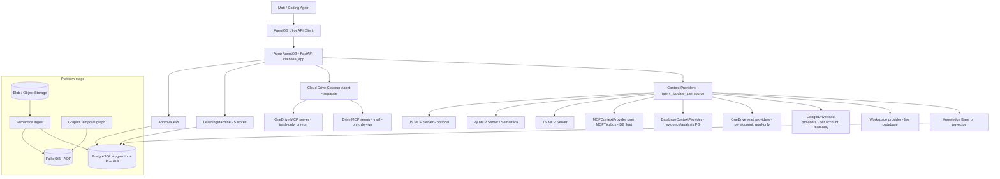
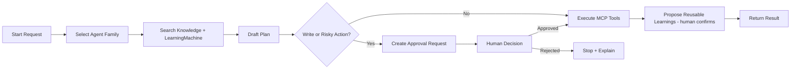
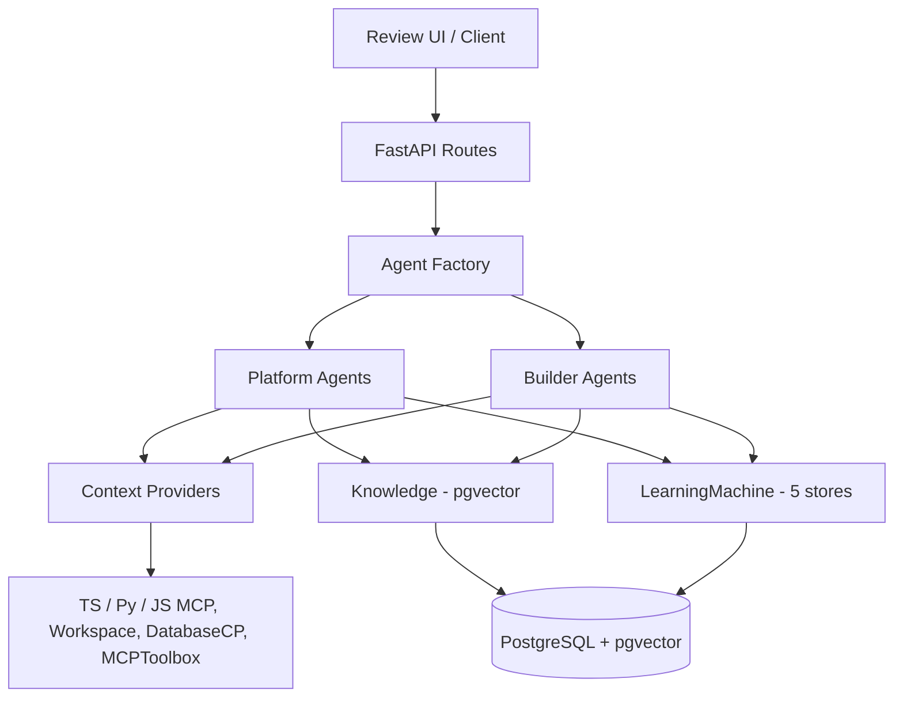
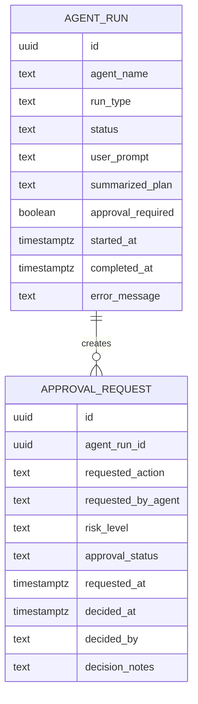
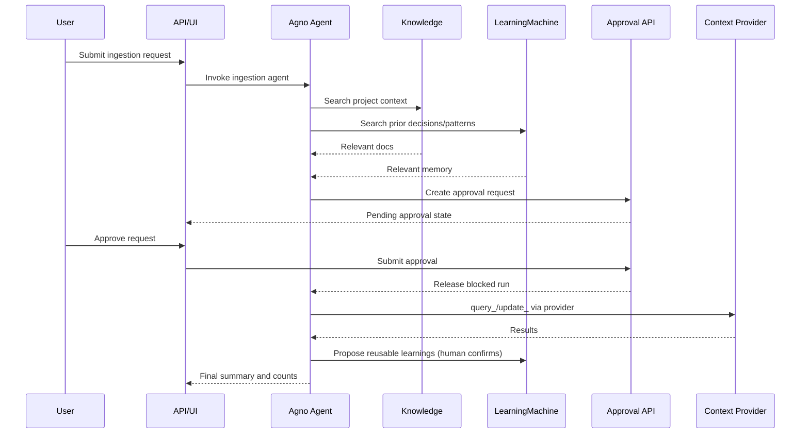

# Agno MCP Platform MVP — Handoff Guide v8

> **Document version:** v8.1.0 · Lineage v0.1.0 → v2 → v3 → v4 → v5 → v6 → v7 → v8 → v8.1 (agent-code reconciliation)
> **Primary reader:** a coding agent (Claude Code or equivalent), secondarily a human maintainer.
> **Status of technical detail:** verified against the live Agno docs MCP **and** the project's installed Agno skill (`/mnt/skills/user/agno`, incl. references for agents/teams/mcp/learning). Where the skill and earlier web sources disagreed, the skill wins and the correction is noted. FalkorDB, Postgres-extension, and Anthropic model facts verified against live sources.
> **v4 changes:** memory restaged to native **LearningMachine** (Graphiti/FalkorDB → platform stage); **Context Providers** adopted as the source-access layer (3.3b); `MultiMCPTools` not-deprecated self-correction; native MCP robustness knobs.
> **v8 changes (this version):** added **OneDrive** as a source (no native provider — MCP server behind `MCPContextProvider`, multi-account reads + cleanup, mirroring Drive; default **MrFixit96/onedrive-mcp-server** for its narrow scopes); **pinned Postgres to v18** for **native UUIDv7** (`uuidv7()`) — dropped the `pg_uuidv7` extension need and re-justified `pgcrypto` as the *hashing* extension (no longer needed for UUIDs); **hash storage standardized on `BYTEA`** (raw digest, `CHECK octet_length`); confirmed **pgvector over Weaviate** for the MVP (Weaviate noted as a Semantica-supported platform-stage option). See §3.3d, §3.3e, §8.1, §10.2.
> **v7 changes:** Drive made **multi-account** (one read provider per Google account, `corpora="user"`); added a **separate Drive Cleanup Agent** with write/reorganize ops via a third-party Drive MCP server (default **piotr-agier/google-drive-mcp**; alt **node2flow**), **trash-only** (permanent-delete/empty-trash excluded), with a **dry-run → approve-plan → auto move/rename + per-item trash confirm** flow. See §3.3d and the new builder agent.
> **v6 changes:** added the native **`GoogleDriveContextProvider`** (`agno.context.gdrive`, read-only `query_gdrive`) for live Drive documents, with a **service-account** auth recommendation; GraphQL confirmed **out of scope for the MVP**.
> **v5 changes:** finalized the **database access layer** (new §3.3c) — **`MCPToolbox`** (Google's MCP Toolbox for Databases) fronts the heterogeneous DB fleet with named toolsets, wrapped behind a native **`MCPContextProvider`** (`query_mcp_<name>`); `DatabaseContextProvider` keeps guarding the evidence Postgres; the native **`Workspace`** provider adopted for the live-codebase source (replaces the custom CodeExplorer); Semantica's `VectorStore`/`ContextGraph` clarified as the *semantic* layer (not general DB ops); **GraphQL** documented as an optional future custom provider.

---

## 0. How to Read This Document (coding-agent orientation)

This is a build contract, not a tutorial. Read sections in this order and act on them in this order:

1. **Section 1–3** — what you are building and the locked architecture. Do not re-litigate these.
2. **Section 4 (Corrections from v1)** — if you have seen the v1 handoff or any cached design, these are the things that were wrong. Internalize them before writing code.
3. **Section 5–10** — the actual spec: scaffold, agents, schema, interfaces, Docker, extensions.
4. **Section 11+** — diagrams, staged build order, testing, runtime, and the bootstrap-into-Semantica story.

Two standing rules for the whole build:

- **Use existing MCP tools; do not reimplement backend capabilities inside Agno agents.** Agents are thin policy/orchestration layers.
- **Human approval is a first-class state.** Any write that touches ingestion, normalization, evidence, production config, or database mutation pauses for an explicit, recorded approval decision.

### Non-Goals for the MVP (scope fence)

Borrowed from Agno's "mini demo agent" discipline — state what we are *not* building so scope doesn't creep:

- **No Slack/Telegram/other chat interfaces in v0.** CLI + AgentOS web UI + REST only. (Dash and Scout add Slack; we defer it.)
- **No production RBAC/JWT in v0** beyond leaving the hook in place; local-first, `RUNTIME_ENV=dev`. Add AgentOS JWT auth when the platform goes multi-user.
- **No autonomous code commits.** Builder agents propose; a human applies. Assisted-coding mode is opt-in and approval-gated.
- **No scheduled/proactive cron actions in v0.** The scheduler hook is documented but off until the approval flow is proven.
- **No FalkorDB / second graph engine, no DuckDB, no extra vector store in the MVP.** Postgres + pgvector only; FalkorDB is a platform-stage addition (Section 17).
- **No bespoke memory storage.** Memory is Agno Knowledge + the native LearningMachine; we do not hand-roll memory tables.
- **No permanent Drive deletion.** The Drive Cleanup Agent is trash-only (reversible); `delete_permanently`/`empty_trash` are never wired in, regardless of request.

---

## 1. Purpose and Scope

This document defines the implementation handoff for an Agno-based assistant layer over an existing MCP Platform. The MVP must ingest project context, reason over roughly nine months of documentation and exported AI conversations, orchestrate existing MCP tools, maintain strong human-in-the-loop (HITL) control, and accumulate durable memory over time.

The MVP does **not** replace the underlying TS, Py, or JS MCP servers. It adds an Agno control layer that does two kinds of work:

- **Platform operation** — coordinating ingestion, normalization, review, and analysis through existing MCP tools.
- **Platform development** — helping continue the build itself: preserving context, proposing implementation changes, and recording durable project learnings.

This second purpose is deliberate and central: **the MVP exists partly to bootstrap its own development into the larger evidence-processing platform** built on Semantica (`Hawksight-AI/semantica`). Architecture choices below are made so that what the MVP stands up carries forward into that platform rather than being thrown away. See Section 17.

The runtime is **Agno AgentOS exposed through FastAPI**, backed by **PostgreSQL + pgvector** (relational state, knowledge embeddings, and the native LearningMachine memory stores). FalkorDB (Graphiti temporal graph + Semantica graph) is introduced at the platform stage, not the MVP.

---

## 2. Target Outcome

The MVP should deliver:

- Local project docs, exported AI conversations, notes, and architecture files loaded into an Agno **Knowledge** base for durable, retrievable project context.
- Two families of agents: **platform agents** and **builder agents**.
- Connection to existing MCP servers via individual `MCPTools` instances (command-based startup first; HTTP/SSE only after command startup is proven stable).
- An **operational memory layer** (native Agno LearningMachine) capturing preferences, session goals/plans, entity facts, and validated patterns — with `PROPOSE` mode for human-confirmed capture of the durable stores.
- Explicit, recorded approval for every write action affecting ingestion, normalization, evidence, production config, or database mutation.
- A usable HTTP API plus Swagger docs through AgentOS/FastAPI so another UI or coding agent can drive the service.

---

## 3. Default Architecture (locked)

### 3.1 Datastores — two, both carry forward

| Store | Role in MVP | Role in Semantica platform later |
|---|---|---|
| **PostgreSQL + pgvector** (custom image) | Agno Knowledge embeddings + **LearningMachine** stores + HITL audit tables (`agent_run`, `approval_request`) | Relational/vector layer; Semantica `vectorstore-pgvector` target |
| **FalkorDB** (AOF persistence + named volume) | **Not in the MVP.** Introduced at the platform stage. | Graphiti evidentiary temporal graph **and** Semantica `graph_store` (native, decision-intelligence tuned to FalkorDB) |

The MVP runs on **Postgres alone** for data (plus the source MCP servers). FalkorDB arrives at the platform stage (Section 17), serving both Graphiti's temporal graph and Semantica's graph on one engine.

There is intentionally **no DuckDB anywhere in the stack** (neither standalone staging nor `pg_duckdb`). Raw evidence for the eventual platform lands in **blob/object storage**, which Semantica reads natively (`semantica[cloud]` covers S3/Azure/GCS). Rationale in Section 9.4 and Section 17.

### 3.2 Memory model — native LearningMachine now; Graphiti at platform stage

The v1 design hand-rolled a `learned_knowledge` SQL table. **That is removed** — Agno's native **LearningMachine** (`agno.learn`) provides it as a first-class, managed feature. The MVP memory layer is:

1. **Agno Knowledge (pgvector)** — durable *reference* corpus: docs, chat-log exports, specs. Read-mostly, populated by ingestion. The project's long-term context.
2. **Agno LearningMachine (Postgres, no extra container)** — operational memory, five native stores:
   - **User Profile** — structured fields (preferences, working style). Captures your stream-of-consciousness preferences.
   - **User Memory** — unstructured observations.
   - **Session Context** (`enable_planning=True`) — goal/plan/progress. This *is* the Project PAL job.
   - **Entity Memory** — facts/events/relationships about third-party entities (people, companies, projects).
   - **Learned Knowledge** — reusable, vector-backed cross-agent lessons (validated query patterns, parser gotchas). The realized form of the v1 "learned_knowledge" dream.
3. **PostgreSQL audit tables** — `agent_run` and `approval_request` only. The HITL trail.

**Why LearningMachine for the MVP (changed from v3's Graphiti-now):** no extra container (rides existing Postgres + pgvector), and **`LearningMode.PROPOSE`** gives *agent proposes, human confirms* memory capture — HITL-native, matching this project's core philosophy. Modes are per-store: `ALWAYS` (auto-extract), `AGENTIC` (agent decides), `PROPOSE` (human-in-the-loop). Use `PROPOSE` for Learned Knowledge and Entity Memory (high-stakes, durable), `ALWAYS`/`AGENTIC` for profile/session.

**Graphiti is not dropped — it is restaged** to the **platform stage** as the *evidentiary temporal graph*, because point-in-time / bitemporal reconstruction ("what was true as of when, and how it changed") is a **domain requirement of the evidence platform**, not an MVP memory feature. At the platform stage the two run side by side without conflict:

| System | Question it answers | Where it lives | Stage |
|---|---|---|---|
| **LearningMachine** | "What do we currently know / prefer / plan?" (operational memory) | Postgres + pgvector | MVP onward |
| **Graphiti / FalkorDB** | "What was true as of when? How did it change?" (evidentiary temporal graph) | FalkorDB (also Semantica's graph) | Platform stage |

They coexist cleanly: LearningMachine stores bind to `db=`/`knowledge=`; Graphiti is reached via `MCPTools` against FalkorDB; namespaces partition them. An agent can read working memory from one and query historical evidence-state from the other in the same run. This is strictly simpler for the MVP (no FalkorDB on day one) and introduces Graphiti exactly when temporal reasoning becomes a hard requirement.

### 3.3 System composition

- **Agno AgentOS** is the FastAPI runtime serving agents and workflows. Custom approval/reindex routes are added via the `base_app` pattern (Section 8.2), **not** by mounting AgentOS on a subpath.
- **Existing TS MCP server** remains the source of parsing, hashing, custody, normalization, queue actions.
- **Existing Py MCP server** remains the source of Semantica-related analysis, embeddings, and document-intelligence routing.
- **Existing JS MCP server** stays optional in MVP; connect only if it exposes useful tools beyond `ping`.
- **Source ContextProviders** (new — see 3.3b) wrap each source so agents see a clean `query_<id>`/`update_<id>` surface instead of raw tool sprawl.
- Project documents and chat exports live in a filesystem knowledge directory and are indexed into Agno Knowledge.

### 3.3b Context Providers — the source-access layer (adopted from Scout/native Agno)

Rather than attaching raw MCPTools and SQL tools directly to agents (tool sprawl, name collisions, system-prompt bloat once you have TS + Py + filesystem + web + DB sources), wrap each source in an Agno **ContextProvider** (`agno.context.*`). Each exposes just **`query_<id>`** (read) and optional **`update_<id>`** (write); behind it is a sub-agent scoped to that one source.

```python
from agno.context.fs import FilesystemContextProvider
from agno.context.database import DatabaseContextProvider
from agno.context.mode import ContextMode

# Frozen archives / docs → read-only filesystem provider
docs = FilesystemContextProvider(root="/workspace/knowledge/platform",
                                 mode=ContextMode.agent)            # query_fs only

# Evidence vs analysis schemas → DB provider with INFRASTRUCTURE-LEVEL read/write split
data = DatabaseContextProvider(
    sql_engine=analysis_engine,        # write sub-agent → analysis schema only
    readonly_engine=evidence_engine,   # read sub-agent → evidence (read-only); CANNOT write
)

agent = Agent(
    model=...,
    tools=[*docs.get_tools(), *data.get_tools()],
    instructions="\n".join([docs.instructions(), data.instructions()]),
)
# Agent sees: query_fs, query_database, update_database
```

Why it matters here:

- **Infrastructure-level read/write separation.** `DatabaseContextProvider`'s read sub-agent uses `readonly_engine` and *physically cannot call write tools* — "infrastructure-level guarantees, not prompt instructions." Strongest form of the evidence-schema protection (Section 6): point `readonly_engine` at `evidence`, `sql_engine` at `analysis`.
- **Per-source sub-agent models.** Cheap model for source tool-work, strong model for synthesis. Cost/latency win that fits the thin-orchestrator principle.
- **Three exposure modes:** `default` (read+write split sub-agents), `agent` (read-only `query_<id>`), `tools` (raw toolkit). Use `agent` for read-only sources (docs, evidence), `default` for approved writes (analysis), `tools` only when building a source-specific agent.

**Built-in providers cover most sources.** Use the native **`Workspace` provider** for the live codebase — it wraps a project directory and exposes one `query_<id>` tool through a read-only sub-agent (list files, search content, read with line numbers; build outputs/caches/virtualenvs excluded by default). This replaces the custom `CodeExplorer` we'd planned. `FilesystemContextProvider` covers docs/archives; `WebContextProvider` covers web; **`GoogleDriveContextProvider`** (`agno.context.gdrive`) covers live Google Drive documents — see 3.3d.

**Custom providers only where nothing fits** (e.g. multi-platform chat-log exports): write a ContextProvider directly — implement `status`, `astatus`, `query`, `aquery`, and `aupdate` (writes); `agno.context.web.provider` is the reference implementation. MCP servers still exist underneath; a provider can wrap an MCP-backed source — but agents talk to providers, not raw tools.

### 3.3c Database access layer (v5 — finalized)

Three distinct database concerns, three distinct mechanisms — they don't overlap:

| Concern | Mechanism | Scope |
|---|---|---|
| **Evidence Postgres** with hard read-only guarantee | `DatabaseContextProvider(sql_engine=analysis, readonly_engine=evidence)` | the one protected DB; infrastructure-level read/write split (3.3b) |
| **General navigation/modification across the heterogeneous DB fleet** | **`MCPToolbox`** behind an **`MCPContextProvider`** | many engines, one clean `query_mcp_databases` surface |
| **Semantic layer** (knowledge graph, ontology, decision tracking) | Semantica `VectorStore` / `ContextGraph` | platform stage; the *meaning/provenance* layer, **not** general DB ops |

**MCPToolbox — the DB-fleet tool source.** Google's MCP Toolbox for Databases runs as a server fronting your various databases and exposes operations as tools. `agno.tools.mcp_toolbox.MCPToolbox` connects to it with **toolset filtering**, which solves the tool-overload problem at the database layer (a toolbox can expose 50+ tools; you load only the named toolset an agent needs):

```python
from agno.tools.mcp_toolbox import MCPToolbox

# Standalone shape (inside AgentOS, lifecycle is auto-managed — no manual connect/close, no reload):
async with MCPToolbox(
    url="http://toolbox:5000",                 # auto-appends /mcp
    toolsets=["evidence-readonly", "casework"], # load only these named toolsets
) as db_tools:
    ...
# Production knobs: load_toolset(name, auth_token_getters={...}, bound_params={"region": ...});
# headers=...; include_tools/exclude_tools; tool_name OR toolsets (mutually exclusive).
```

**Wrapped behind a Context Provider** (your choice), so agents see one clean tool instead of the toolbox's raw set:

```python
from agno.context.mcp import MCPContextProvider   # read-only by default → query_mcp_<name>

databases = MCPContextProvider(
    id="databases",
    # points at the same MCP Toolbox server; sub-agent owns toolset selection + quirks
    url="http://toolbox:5000",
)
# Agent sees: query_mcp_databases   (navigation/reads)
```

**Reads vs. modifications (HITL).** `MCPContextProvider` is **read-only by default** — perfect for the *navigate* half. For *modify*, do **not** silently open writes: route database modifications through the **approval gate** (Section 9.2) like any other write action. Concretely, a write goes: agent drafts the change → Review Gatekeeper produces a plain-English approval request → on approval, the write executes via MCPToolbox in write mode (or a `default`-mode provider). This keeps DB mutations under the same HITL guarantee as evidence handling — which, given evidence integrity, is the behavior you want anyway.

**GraphQL — out of scope for the MVP (confirmed).** Not in Agno's or Semantica's native DB path; kept behind the Non-Goals fence. If wanted later, wrap the GraphQL endpoint as a **custom ContextProvider** (`query`/`aquery` against the endpoint) so agents see `query_<source>` consistently. Deferred, not forgotten.

### 3.3d Google Drive sources — multi-account read + separate write/cleanup (v7)

Live, human-curated documents in Google Drive are reached via the native **`GoogleDriveContextProvider`** (`agno.context.gdrive`) — one **read-only** `query_gdrive` tool that searches and reads Drive files, including Google Docs and Sheets. There is no write path (good: agents navigate Drive, they don't mutate it).

```python
from agno.context.gdrive import GoogleDriveContextProvider

# Service-account auth (recommended): GOOGLE_SERVICE_ACCOUNT_FILE=/path/to/sa.json
# Then SHARE the specific Drive folders/files with the service account's email.
drive = GoogleDriveContextProvider(
    id="gdrive",
    corpora="drive", drive_id="0ABcd...",   # scope to ONE Shared Drive (least-surprising)
    # corpora options: "user" (personal only) | "drive"+drive_id | "domain" | "allDrives"
)
# Agent sees: query_gdrive
```

- **Auth — use a service account, not personal OAuth.** The agent reads Drive *as its own service account*, not as you: create the SA once, share only the intended folders with its email, and it can read exactly what you granted — no browser consent, no OAuth token, no impersonation. (OAuth-personal exists via `GOOGLE_CLIENT_ID/SECRET/PROJECT_ID` with a cached `gdrive_token.json`, but the service account is the cleaner, least-privilege fit for an evidence workflow.)
- **Scope tightly.** Default `corpora="allDrives"` searches everything accessible; for evidence work prefer `"user"` or a single Shared Drive via `corpora="drive"` + `drive_id`, so the agent's reach is exactly the shared set.
- **Complements blob storage, doesn't replace it.** Drive = live, curated documents navigated on demand (Scout-style). Blob storage stays the raw-evidence landing zone that Semantica ingests (Section 17). Use Drive for "find and read the current planning doc," blob+Semantica for archival evidence with provenance.
- **Privacy note:** this is a read path into a user's Drive. Honor least privilege (narrow `corpora`, share only needed folders); never widen scope to pull broader Drive content than the task needs.

#### Multiple Google accounts (the real situation)

The drives span **several separate Google accounts**, so one provider/identity can't see them all. Run **one `GoogleDriveContextProvider` per account**, each with its own credentials and a distinct `id`, all `corpora="user"` (personal Drive — there are no Shared Drives here):

```python
from agno.context.gdrive import GoogleDriveContextProvider

drive_personal = GoogleDriveContextProvider(id="gdrive_personal", corpora="user")   # creds/account A
drive_work     = GoogleDriveContextProvider(id="gdrive_work",     corpora="user")   # creds/account B
# Agent sees: query_gdrive_personal, query_gdrive_work  (read-only, no name collision)
```

Each account needs its own auth (separate service-account JSON or OAuth token; env vars suffixed per account, e.g. `GOOGLE_SA_FILE_PERSONAL`, `GOOGLE_SA_FILE_WORK`). These read providers feed the normal navigation/knowledge use; they do **not** write.

#### Separate Drive Cleanup Agent (write/reorganize)

The native Agno Drive toolkit's write surface is only `upload`/`download` — **no move/rename/trash**. This is a known gap in first-party Drive connectors. So real decluttering uses a **third-party Drive MCP server** behind an `MCPContextProvider`, driven by a **dedicated, completely separate Drive Cleanup Agent** (not the read agents).

- **Server (default): `piotr-agier/google-drive-mcp`** (self-hostable) — create, update, delete, rename, move, copy, upload, download, folder-path navigation (`/Work/Projects`), plus Docs editing. **Alternative: `node2flow/google-drive`** (Smithery, ~23 tools incl. revision history and empty-trash — more complete, useful for a recovery mess). Either runs as an MCP server per account and is wrapped:

```python
from agno.context.mcp import MCPContextProvider

drive_cleanup = MCPContextProvider(
    id="drive_cleanup",
    url="http://gdrive-mcp:PORT",
    # TRASH-ONLY: expose reversible ops; NEVER expose permanent-delete / empty-trash
    include_tools=["search", "list", "get_metadata",        # read/plan
                   "create_folder", "move", "rename", "trash"],  # reversible writes
    # (do NOT include: delete, delete_permanently, empty_trash)
)
# Agent sees: query_mcp_drive_cleanup
```

- **Destructive-op policy (locked):** **permanent-delete and empty-trash are excluded entirely** — never wired in. `trash` is allowed because it's reversible (~30-day recovery). Given the recovery-debacle history, this is non-negotiable: a permanent delete on a just-recovered Drive is how a second debacle happens.

- **Dry-run → approve → apply (HITL flow, locked):**
  1. **Plan (dry-run):** the Cleanup Agent uses **read tools only** and emits a structured reorganization plan — every intended `move`/`rename`/`trash` with before→after. Nothing is executed.
  2. **Approve the plan:** you review the whole plan in one batch approval (Review Gatekeeper renders it in plain English).
  3. **Apply:** on approval, `move`/`rename` execute **automatically**; each **`trash`** still surfaces an **individual confirm**. (Auto for move/rename, per-item approval for trash — with the dry-run preview as the safety net.)

- **Separation:** the Cleanup Agent is its own agent with its own provider and its own (write-capable) credentials. The read providers above remain strictly read-only. No single agent both freely reads-for-knowledge and mutates Drive.

- **Privacy note:** a write path into personal Drives. Least privilege still applies — the cleanup MCP server should be scoped per account, and the agent never touches accounts/folders outside the task. Trash-only + dry-run + approval are the guardrails.

### 3.3e OneDrive sources (v8) — symmetric with Drive

There is **no native Agno OneDrive provider** (the catalog is FS/DB/Web/MCP/Slack/Gmail/Calendar/Drive/Wiki). OneDrive is reached the same way as the Drive write path: a **OneDrive MCP server behind `MCPContextProvider`**, one per Microsoft account.

- **Server (default): `MrFixit96/onedrive-mcp-server`** — chosen for safety: it was built after a security audit found critical vulnerabilities in another popular Microsoft MCP server, and uses **narrow OAuth scopes (only `Files.ReadWrite` + `User.Read` — no mail/calendar/contacts)**, an owner-only token cache, and path-traversal protection. **Alternative for multi-account convenience: `elyxlz/microsoft-mcp`** (native multi-account, but it's the server that audit flagged — prefer MrFixit96 per-account). All operations go through Microsoft Graph API.
  > **Microsoft-official caveat:** Microsoft **deprecated** its first-party SharePoint/OneDrive MCP servers on 2026-03-13 in favor of newer "Work IQ" servers — anything Microsoft-official is in flux, so a self-hosted third-party server is the stable choice.

- **Reads — multi-account**, mirroring Drive: one `MCPContextProvider` per Microsoft account, read-tool-filtered, distinct `id` → `query_mcp_onedrive_<account>`. Auth via Azure App Registration (`MICROSOFT_CLIENT_ID`, optional `MICROSOFT_TENANT_ID`) per account; tokens cached per account.

```python
from agno.context.mcp import MCPContextProvider

onedrive_personal = MCPContextProvider(
    id="onedrive_personal",
    url="http://onedrive-mcp-personal:PORT",
    include_tools=["search", "list", "read"],     # read-only
)
# Agent sees: query_mcp_onedrive_personal
```

- **Writes/cleanup** — the **same Drive Cleanup Agent** handles OneDrive too (it's source-agnostic): a write-filtered `MCPContextProvider` over the OneDrive MCP server, **trash-only** (no permanent delete), same **dry-run → approve-plan → auto move/rename + per-item trash confirm** flow. Scope OAuth to `Files.ReadWrite` and nothing else.

- **Note on the OneDrive↔SharePoint split:** Microsoft uses different Graph endpoints/scopes for OneDrive vs SharePoint files. If any of your data lives in SharePoint document libraries (not pure OneDrive), confirm the chosen server covers it (MrFixit96 is OneDrive-focused; some servers like the Arcade/kennyr859 ones are unified OneDrive+SharePoint). Verify before pointing at real data.

### 3.4 Design principles

- Existing MCP tools first; keep agents thin and policy-driven; keep data handling in MCP servers.
- Separate operational agents from builder agents to avoid cross-contamination of duties.
- Approval is a persisted state machine, not a prompt convention.
- Durable lessons go into the native LearningMachine (Learned Knowledge / Entity Memory stores), not into prompt-stuffing or a bespoke table. Source access goes through Context Providers, not raw tools.

---

## 4. Corrections From v1 (read before coding)

These are verified deltas from the original handoff. Each was wrong or stale in v1 and is fixed in v2.

| # | v1 said | Verified reality | v2 fix |
|---|---|---|---|
| 1 | `app.mount("/path", agentos_app)` | Mounting AgentOS on a subpath **breaks MCP** (Agno issue #4958). | Use `AgentOS(base_app=fastapi_app)` then `agent_os.get_app()`. See 8.2. |
| 2 | Manual `build_mcp_tools()` + reconnect logic in the run loop | Inside AgentOS, MCP connection lifecycle is **handled automatically** (`mcp_lifespan`). Manual `.connect()`/`.close()` is only for standalone scripts. | Remove manual lifecycle from the agent run path; document the standalone pattern separately. See 7.2. |
| 3 | (implied) one tool object for multiple servers | **v4 self-correction:** `MultiMCPTools` is **NOT deprecated** — it's current (confirmed in the installed Agno skill, `references/mcp.md`). | Multi-server is a **style choice**: one `MCPTools` per server, *or* a single `MultiMCPTools`. Use `tool_name_prefix` to avoid collisions. See 7.2. |
| 4 | (not mentioned) | `reload=True` **breaks MCP** under AgentOS. | Never run the AgentOS app with reload enabled. Added to fragile areas. |
| 5 | `build_knowledge_base(base_path, db_url, table_name)` | Current `Knowledge` takes `vector_db=` **and** `contents_db=`; the `contents_db` powers the AgentOS Knowledge UI. | New signature in 7.1. |
| 6 | Custom loader walks the tree and calls "Agno Knowledge loader" | Ingestion is `knowledge.insert(...)` / `knowledge.ainsert(...)`; content embeds automatically on insert. | Your script does normalization + manifest, then hands **paths** to Agno's native insert. See 7.1 / 9.x. |
| 7 | Hand-rolled `learned_knowledge` table + `store_learned_knowledge()` framed as a "learning machine" | **The actual "learning machine" exists natively:** Agno's `LearningMachine` (`agno.learn`) — five stores (User Profile, User Memory, Session Context, Entity Memory, Learned Knowledge) with `ALWAYS`/`AGENTIC`/`PROPOSE` modes. | **v4:** use native `LearningMachine` for MVP memory (3.2); custom table dropped. Graphiti restaged to platform stage. |
| 8 | `gpt-4o` / `gpt-5-mini`-era defaults | Current Anthropic IDs: `claude-opus-4-8`, `claude-sonnet-4-6`, `claude-haiku-4-5-20251001`. | Provider-agnostic factory, **no hard default**, pinned versioned IDs. See 10.3. |
| 9 | `VECTOR(1536)` with no caveat | Correct for OpenAI `text-embedding-3-small`, **but dim must match the embedder; switching embedder ⇒ re-embed everything**. | Dimension note added wherever embeddings appear. |
| 10 | Hybrid search unspecified | Agno Knowledge supports `SearchType.hybrid`; proper BM25 is available via `pg_textsearch`. | Use Agno hybrid for MVP; bake `pg_textsearch` into the image. See 10.4. |
| 11 | `add_content_async(...)` ingestion | **Verified against live docs:** current API is **`knowledge.insert(...)` / `knowledge.ainsert(...)`** (`name=`, `path=`/`url=`, `metadata=`). | Use `ainsert` (async) / `insert` (sync). Fixed in 7.1. |
| 12 | API/UI on port 8000 throughout | Bare AgentOS default is **7777**; the Agno Docker examples expose **8000** via a `PORT` env. | Standardize on 8000 via `PORT`; note 7777 as the bare default. |
| 13 | "Never use `reload=True`" (blanket) | **Verified:** reload only breaks the **MCP lifespan**. Non-MCP dev reload is fine and sanctioned via `RUNTIME_ENV=dev`. | Precise rule: reload off **when MCPTools are attached**; otherwise dev reload OK. 10.1/14. |
| 14 | `enable_user_memory` (hedged) | **Verified:** it's **`enable_user_memories`** (plural), db-persisted; `update_memory_on_run` and `enable_agentic_memory` are mutually exclusive; `AgentMemory`/`TeamMemory` removed in Agno v2. | Use correct flag; note the mutual-exclusivity footgun. |
| 15 | Custom routes vs AgentOS routes unspecified | `on_route_conflict="preserve_base_app"` controls collisions. | Add to wiring (8.2). |
| 16 | MCP only as consumer | AgentOS can also **expose itself** as an MCP server via `enable_mcp_server=True`. | Distinguish the two roles (8.2); optional for letting coding agents drive the platform. |
| 17 | Agents hold raw source tools (implied) | **Context Providers** (`agno.context.*`) wrap each source as `query_<id>`/`update_<id>` with a scoped sub-agent; `DatabaseContextProvider` gives infrastructure-level read/write split. | Adopt the provider layer (3.3b); use it for evidence read-only enforcement. |
| 18 | Stale MCP connections / multi-server collisions hand-waved | Native knobs: `refresh_connection=True`, `tool_name_prefix`, `header_provider`. | Replace speculative mitigations with these (7.2, 14). |

Two v1 "Open Questions" are now **resolved** and should not be reopened:
- *Production default model provider:* there is **no hard default** — a provider-agnostic factory selects by available credentials (10.3).
- *Where learned knowledge lives:* the native **LearningMachine "Learned Knowledge" store** on Postgres/pgvector for the MVP (3.2); the evidentiary temporal graph (Graphiti/FalkorDB) is a platform-stage addition, not a memory mirror.

---

## 5. File and Folder Scaffold

```text
agno_mvp_skeleton/
├── .dockerignore
├── example.env                 # convention from agno templates (was .env.example)
├── compose.yaml                # services: agentos-api, agentos-db (pg), falkordb
├── pyproject.toml              # dependency source of truth
├── requirements.txt            # generated from pyproject via scripts/generate_requirements.sh
├── Dockerfile                  # app image (built deps, not pip-at-startup)
├── docker/
│   └── postgres/
│       └── Dockerfile          # custom PG: pgvector + postgis + pg_textsearch
├── README.md
├── HANDOFF_INSTRUCTIONS.md
├── CLAUDE.md                   # agent README (instructions for coding agents working the repo)
├── app/
│   └── main.py                 # AgentOS via base_app pattern (NOT mount); scheduler/tracing hooks
├── agents/
│   ├── factory.py
│   ├── instructions.py
│   ├── ingestion.py            # runnable: python -m agents.ingestion  (loads knowledge)
│   ├── providers.py            # ContextProvider wiring (Workspace, FS, per-account gdrive read, DB fleet)
│   └── drive_cleanup.py        # separate Drive Cleanup Agent (write MCP, trash-only, dry-run)
├── db/
│   └── __init__.py             # get_postgres_db() — single DB-config entry point (template pattern)
├── config/
│   └── settings.py             # the only place os.getenv() is read; provider factory
├── knowledge/
│   └── platform/
│       ├── conversations/
│       ├── docs/
│       └── notes/
├── memory/
│   └── README.md               # how agents use the LearningMachine stores + (later) Graphiti
├── prompts/
├── scripts/
│   ├── generate_requirements.sh
│   └── ingest_knowledge.py     # deterministic normalize + manifest, then knowledge.ainsert(path=...)
├── sql/
│   ├── 0001_init_extensions.sql
│   └── 0002_schema.sql
├── evals/                      # first-class evals (dash pattern): accuracy/routing/governance/boundaries
└── ui/
    └── review_schema.ts
```

This layout deliberately mirrors `agno-agi/agentos-docker-template` (canonical `agents/ app/ db/ scripts/` + `compose.yaml`, `example.env`, `pyproject.toml`) so any Agno-familiar coding agent is immediately oriented.

### Folder responsibilities

- `app/` — AgentOS runtime entry point and custom route registration (one place only).
- `agents/` — agent construction, instructions, tool registration, team definitions.
- `config/` — environment-derived settings and the provider-selection factory. The only place `os.getenv()` is read.
- `knowledge/platform/` — imported chats, docs, specs, normalized notes, indexed into Agno Knowledge.
- `memory/` — documentation of how agents use the LearningMachine stores (and, at platform stage, the Graphiti temporal graph).
- `scripts/` — deterministic, side-effect-light scripts (indexing, manifest, migration prep).
- `sql/` — ordered migrations: extensions first, then schema.
- `ui/` — front-end state contracts for the review/approval panel.

---

## 6. Agent Topology

### Platform agents

1. **Ingestion Orchestrator** — receives plain-language instructions, searches Knowledge, inspects available tools, calls TS/Py MCP tools to hash, parse, normalize, route. *Writes:* yes, only after a recorded approval. *Outputs:* tool plan, selected parser, hash status, normalized record counts, destination stores, anomalies, rollback notes.
2. **Analysis Orchestrator** — runs Semantica-related analysis after data exists in storage; produces structured analytical artifacts. *Writes:* derived artifacts only, after approval. *Outputs:* facts, inferences, confidence notes, provenance summary, review recommendation.
3. **Review Gatekeeper** — translates technical actions into plain-English approval requests; persists the decision; releases or blocks the next step. *Writes:* approval tables and audit notes only. *Outputs:* human-readable approval prompt, risk rating, impact summary, affected systems, rejection reason if blocked.

### Builder agents

1. **Dev Copilot** — uses Knowledge + LearningMachine memory to propose repo changes, migration strategies, interface contracts, tests. *Writes:* no production writes; suggestions only unless explicitly switched into assisted-coding mode. *Outputs:* file list, interfaces, assumptions, migration impact, testing plan, implementation order.
2. **Project PAL** — maintains rolling memory of goals, blockers, decisions, preferences, and session context. *Backed by the LearningMachine's Session Context + User Memory stores, not a custom table.* *Writes:* memory stores only. *Outputs:* concise progress summary, active blockers, next actions, newly recorded durable knowledge.
3. **Forensic Data Agent** — explains schemas, queries data through approved interfaces, and retains validated query patterns ("schema gotchas and safe query shapes") in the LearningMachine's Learned Knowledge store. *Writes:* no schema writes in MVP. *Outputs:* query rationale, safe query shape, result summary, confidence caveats.
4. **Cloud Drive Cleanup Agent** (separate, write-capable — see 3.3d/3.3e) — reorganizes the multi-account **Google Drive *and* OneDrive** mess via third-party MCP servers (Drive: piotr-agier; OneDrive: MrFixit96) behind `MCPContextProvider`s. *Tools:* trash-only write set (`create_folder`/`move`/`rename`/`trash`) plus reads; **permanent-delete/empty-trash never wired in**. *Flow:* dry-run plan → batch-approve → auto move/rename, per-item trash confirm. *Writes:* Drive only, through the approval gate; never touches the evidence DB or memory stores. *Outputs:* a structured reorg plan (before→after per file), then an applied-changes report with trash-recovery notes.

> **Read-only is enforced at the database, not in the prompt.** The preferred mechanism (v5) is the **`DatabaseContextProvider`** (3.3b/3.3c): its read sub-agent uses `readonly_engine` (pointed at `evidence`) and *physically cannot* call write tools; writes go through `sql_engine` (pointed at `analysis`). Equivalent lower-level guardrails if not using the provider: a connection with `default_transaction_read_only=on`, plus a SQLAlchemy event listener blocking DDL/DML against the protected schema. Either way these are infrastructure guarantees layered *under* the HITL approval gate, not a replacement for it. The broader DB fleet is reached via `MCPToolbox`/`MCPContextProvider` (3.3c), with modifications routed through approval.

### Dual-schema boundary (adopted from `dash`)

Mirror dash's `public` vs agent-managed split onto the evidence domain:

| Schema | Owner | Access |
|---|---|---|
| `evidence` (raw/source) | ingestion pipeline | **read-only** — never modified by agents |
| `analysis` (derived) | Analysis Orchestrator, after approval | views, summaries, computed artifacts |

Raw evidence is structurally protected; derived analysis lives separately and is still approval-gated. This pairs with the read-only enforcement above.

### Team coordination (adopted from `vibe-video`)

Two layers of Team mode (corrected — see `agents/factory.py`): the **top-level Router uses `mode="route"`** (leader routes a request to exactly one family — Platform Ops vs Builder vs Cloud Cleanup — and returns that family's answer), while **each family Team uses `mode="coordinate"`** (leader delegates to members and synthesizes). `route` is the correct router pattern; `coordinate` is the supervisor pattern. Session-history policy, stated numerically: keep the **last 10 runs in context** (`add_history_to_context=True, num_history_runs=10`) and make the **last ~5 sessions searchable** via the LearningMachine session store.

---

## 7. Function Signatures and Service Interfaces

These are the implementation contract. **Confirm exact Agno symbol names against the installed version** — Agno's memory/knowledge APIs have churned across 2.x (e.g. `enable_user_memory` vs `enable_user_memories`).

### 7.1 Knowledge construction (corrected)

```python
from agno.knowledge.knowledge import Knowledge
from agno.vectordb.pgvector import PgVector, SearchType
from agno.db.postgres import PostgresDb

def build_knowledge(
    db_url: str,
    vector_table: str = "knowledge_vectors",
    contents_table: str = "knowledge_contents",
    embedder=None,                 # default: OpenAI text-embedding-3-small (1536-d)
) -> Knowledge:
    """
    Build the Agno Knowledge object.

    vector_db  -> PgVector: stores embeddings; SearchType.hybrid recommended.
    contents_db-> PostgresDb: powers the AgentOS Knowledge UI (content registry).

    DIMENSION CONTRACT: the pgvector column dimension MUST equal the embedder's
    output dim (1536 for text-embedding-3-small). Changing embedders requires
    re-embedding the entire corpus.
    """
    return Knowledge(
        vector_db=PgVector(
            table_name=vector_table,
            db_url=db_url,
            search_type=SearchType.hybrid,
            embedder=embedder,
        ),
        contents_db=PostgresDb(db_url=db_url, knowledge_table=contents_table),
    )
```

Ingestion uses Agno's native insert — do **not** write a custom "loader". The current API (verified against live docs) is `knowledge.insert(...)` (sync) / `knowledge.ainsert(...)` (async):

```python
async def ingest_path(knowledge: Knowledge, path: str, name: str, metadata: dict) -> None:
    """Normalize/manifest happens upstream; here we hand a path to Agno,
    which reads + chunks + embeds automatically. `name` labels the content;
    `path` may be a local file/dir OR a cloud URL (Agno reads S3/Azure/GCS natively
    with semantica-style cloud creds), which is relevant for the blob-storage path."""
    await knowledge.ainsert(name=name, path=path, metadata=metadata)
```

### 7.1b Memory construction — LearningMachine (MVP)

```python
from agno.learn import (
    LearningMachine, LearningMode,
    UserProfileConfig, UserMemoryConfig,
    SessionContextConfig, EntityMemoryConfig, LearnedKnowledgeConfig,
)

def build_learning(db, model, knowledge) -> LearningMachine:
    """Native operational memory on the existing Postgres (no extra container).
    PROPOSE = agent proposes, human confirms — HITL-native capture for the
    high-stakes durable stores."""
    return LearningMachine(
        user_profile=UserProfileConfig(mode=LearningMode.ALWAYS),
        user_memory=UserMemoryConfig(mode=LearningMode.AGENTIC),
        session_context=SessionContextConfig(mode=LearningMode.ALWAYS, enable_planning=True),
        entity_memory=EntityMemoryConfig(mode=LearningMode.PROPOSE),      # HITL
        learned_knowledge=LearnedKnowledgeConfig(                         # the v1 dream, native
            mode=LearningMode.PROPOSE,                                    # HITL
            knowledge=knowledge, namespace="platform",
            agent_can_save=True, agent_can_search=True,
        ),
    )
# Attach via Agent(..., db=db, learning=build_learning(...)).
# Safety: leave enable_clear_memories=False (no bulk deletion).
```

### 7.2 MCP tools + Context Providers (corrected)

```python
from agno.tools.mcp import MCPTools  # MultiMCPTools also available (NOT deprecated)

def make_mcp_tools(command: str | None = None, url: str | None = None,
                   transport: str = "streamable-http", prefix: str | None = None) -> MCPTools:
    """One MCPTools PER server is the simple default; a single MultiMCPTools is an
    equally-valid alternative for many servers. Robustness knobs:
      - tool_name_prefix=prefix   -> avoid cross-server tool-name collisions
      - refresh_connection=True   -> refresh if server state changes between runs
      - header_provider=lambda: {...}  -> dynamic auth headers
    Inside AgentOS, do NOT manually connect/close — AgentOS manages the MCP lifespan.
    Manual `async with MCPTools(...)` is ONLY for standalone scripts."""
    return MCPTools(command=command, url=url, transport=transport,
                    tool_name_prefix=prefix, refresh_connection=True)
```

Prefer **Context Providers** (3.3b) over attaching these raw to agents: wrap the source and expose `query_<id>`/`update_<id>`. Reserve raw `MCPTools` for cases a provider can't cover.

### 7.3 Agents, runtime, approvals

```python
async def build_agent_team(settings) -> dict:
    """Return all agents keyed by stable public name. Source access via Context
    Providers (provider.get_tools()); memory via the LearningMachine on `db`."""

def build_agentos(settings):
    """Construct FastAPI app, register custom routes, wrap with AgentOS via
    base_app (on_route_conflict='preserve_base_app'), return agent_os.get_app(). See 8.2."""

async def create_approval_request(agent_run_id: str, action: str, risk_level: str) -> str:
    """Persist a pending approval_request; return its id."""

async def record_approval_decision(approval_id: str, decision: str, actor: str, notes: str) -> None:
    """Update approval_request; release or terminate the blocked workflow."""
```

> Note: there is **no** `store_learned_knowledge(...)`. Durable lessons go into the LearningMachine's Learned Knowledge / Entity Memory stores under `LearningMode.PROPOSE` (human confirms) — capture policy in 9.3.

### 7.4 HTTP route shapes

`POST /v1/approval-requests`
```json
{ "agentRunId": "7f8d8c6a-3f74-4be7-9659-4f1bf8d1a0ef",
  "requestedAction": "Run Facebook parser and write normalized records to PostgreSQL",
  "riskLevel": "high" }
```
→
```json
{ "id": "0d14d8ef-b3fe-4389-a0c2-5fd8f0d21163",
  "approvalStatus": "pending", "requestedAt": "2026-05-23T18:00:00Z" }
```

`POST /v1/approval-requests/{id}/decision`
```json
{ "decision": "approved", "decidedBy": "Matt",
  "decisionNotes": "Proceed with ingestion only, no analysis yet." }
```
→
```json
{ "id": "0d14d8ef-b3fe-4389-a0c2-5fd8f0d21163",
  "approvalStatus": "approved", "decidedAt": "2026-05-23T18:03:00Z" }
```

`POST /v1/knowledge/reindex`
```json
{ "basePath": "/workspace/knowledge/platform", "recreate": false }
```
→
```json
{ "indexedDocumentCount": 482, "status": "completed" }
```

---

## 8. Data Models, Schema, and Runtime Wiring

### 8.1 SQL — extensions first, then schema

`sql/0001_init_extensions.sql` (all plain `CREATE EXTENSION`, no preload/restart):

```sql
CREATE EXTENSION IF NOT EXISTS vector;       -- embeddings (required)
CREATE EXTENSION IF NOT EXISTS postgis;      -- geospatial (provisioned now)
CREATE EXTENSION IF NOT EXISTS pg_trgm;      -- fuzzy/trigram match; feeds dedup later
CREATE EXTENSION IF NOT EXISTS pgcrypto;     -- HASHING only (digest/hmac for custody). NOT for UUIDs on PG18.
CREATE EXTENSION IF NOT EXISTS btree_gin;    -- mixed scalar+text composite indexes
CREATE EXTENSION IF NOT EXISTS btree_gist;
CREATE EXTENSION IF NOT EXISTS unaccent;     -- accent-insensitive FTS for messy logs
-- UUIDv7: NATIVE on PostgreSQL 18 via uuidv7() — NO extension needed (image is pinned to PG18, §10.2).
--         gen_random_uuid()/uuidv4() are also core. The pg_uuidv7 extension is only for PG<18.
-- pg_textsearch: PRESENT IN THE IMAGE but not enabled by default.
-- Enable + index in place when Agno's built-in hybrid proves insufficient (10.4).
```

`sql/0002_schema.sql`:

```sql
CREATE TABLE agent_run (
  id UUID PRIMARY KEY DEFAULT uuidv7(),   -- PG18 native; timestamp-ordered, better index locality
  agent_name TEXT NOT NULL,
  run_type TEXT NOT NULL CHECK (run_type IN ('platform','builder')),
  status TEXT NOT NULL CHECK (status IN
    ('queued','running','awaiting_approval','completed','failed','cancelled')),
  user_prompt TEXT NOT NULL,
  summarized_plan TEXT,
  approval_required BOOLEAN NOT NULL DEFAULT TRUE,
  started_at TIMESTAMPTZ NOT NULL DEFAULT NOW(),
  completed_at TIMESTAMPTZ,
  error_message TEXT
);

CREATE TABLE approval_request (
  id UUID PRIMARY KEY DEFAULT uuidv7(),   -- PG18 native; timestamp-ordered
  agent_run_id UUID NOT NULL REFERENCES agent_run(id) ON DELETE CASCADE,
  requested_action TEXT NOT NULL,
  requested_by_agent TEXT NOT NULL,
  risk_level TEXT NOT NULL CHECK (risk_level IN ('low','medium','high','critical')),
  approval_status TEXT NOT NULL CHECK (approval_status IN
    ('pending','approved','rejected','expired')),
  requested_at TIMESTAMPTZ NOT NULL DEFAULT NOW(),
  decided_at TIMESTAMPTZ,
  decided_by TEXT,
  decision_notes TEXT
);

-- Custody/integrity hashes (digests come from the TS MCP server, or pgcrypto digest()).
-- Belongs in the read-only `evidence` schema if hashes are themselves evidence.
CREATE TABLE evidence_hash (
  id UUID PRIMARY KEY DEFAULT uuidv7(),
  source_ref TEXT NOT NULL,                       -- what was hashed (path/object key/record id)
  algo TEXT NOT NULL DEFAULT 'sha256',
  digest BYTEA NOT NULL,                           -- RAW bytes, not hex text (32B for sha256)
  hashed_at TIMESTAMPTZ NOT NULL DEFAULT NOW(),
  CHECK (algo <> 'sha256' OR octet_length(digest) = 32)  -- enforce width per algorithm
);

CREATE INDEX idx_agent_run_status
  ON agent_run(status, started_at DESC);
CREATE INDEX idx_approval_request_status
  ON approval_request(approval_status, requested_at DESC);
CREATE INDEX idx_evidence_hash_digest
  ON evidence_hash(digest);                        -- fast dedup / integrity lookup
```

> **Hash storage rationale.** Store digests as **`BYTEA`** (raw bytes), not hex/base64 text: ~half the storage (32B vs 64 hex chars for SHA-256), faster indexing, no encoding ambiguity. The `CHECK octet_length` enforces the algorithm's width. Compute hashes in the TS MCP server (already does this) or in-DB via `pgcrypto`'s `digest(data,'sha256')` — which is why `pgcrypto` stays in the extension set even though PG18 no longer needs it for UUIDs. For fast *non*-cryptographic checksums (dedup hints), PG18's core `crc32c()` is available without pgcrypto.

> The v1 `learned_knowledge` table is intentionally absent. Memory lives in the native LearningMachine stores on this same Postgres (3.2). Agno also creates its own Knowledge tables (`vector_db` / `contents_db`); let Agno manage those rather than hand-defining them.

Approval UI contract (`ui/review_schema.ts`):

```ts
export interface ApprovalRequestViewModel {
  id: string;
  agentRunId: string;
  requestedAction: string;
  requestedByAgent: string;
  riskLevel: 'low' | 'medium' | 'high' | 'critical';
  approvalStatus: 'pending' | 'approved' | 'rejected' | 'expired';
  requestedAt: string;
  decidedAt?: string;
  decidedBy?: string;
  decisionNotes?: string;
}
```

### 8.2 AgentOS wiring (corrected — base_app, not mount)

```python
from fastapi import FastAPI
from agno.os import AgentOS

def build_agentos(settings):
    app = FastAPI(title="MCP Platform Assistant")

    # register custom routes on `app` BEFORE wrapping
    register_approval_routes(app)
    register_knowledge_routes(app)

    agents = build_agent_team(settings)  # each agent gets per-server MCPTools

    agent_os = AgentOS(
        agents=list(agents.values()),
        base_app=app,                              # CORRECT: pass FastAPI app in
        on_route_conflict="preserve_base_app",     # our approval/knowledge routes win on collision
        scheduler=True,                            # hook for future proactive tasks (off-by-policy in v0)
        tracing=True,                              # observability (dash pattern)
        # enable_mcp_server=True,                  # OPTIONAL: also EXPOSE this platform as an MCP server
                                                   #   so coding agents can drive it. Distinct from CONSUMING
                                                   #   the TS/Py/JS MCP servers via Context Providers / MCPTools.
    )
    return agent_os.get_app()    # CORRECT: serve this; do NOT app.mount(...)

# Running:
#   Default bare-AgentOS port is 7777; we standardize on 8000 via the PORT env to match
#   the Agno Docker templates. RUNTIME_ENV=dev may enable auto-reload IN GENERAL, but
#   reload MUST be OFF whenever MCPTools are attached — it breaks the MCP lifespan
#   (official Agno MCP examples carry this exact warning). So in this app: no reload.
#   agent_os.serve(app="app.main:app")            # canonical run helper, no reload
```

**Two MCP roles, kept distinct:** this platform *consumes* MCP servers (TS, Py, Graphiti) by attaching `MCPTools` to agents; it can also *expose itself* as an MCP server via `enable_mcp_server=True`, letting external coding agents call our agents as tools. The MVP only needs the consumer role; the exposer role is a cheap future option for the bootstrap-into-development goal.

---

## 9. Validation, Normalization, and Core Algorithms

### 9.1 File ingestion normalization

Before handing paths to Agno Knowledge:

- Accept `.md`, `.txt`, `.json`, `.csv`, `.pdf`, `.docx`.
- Reject binary executables, archives, and media from knowledge ingestion.
- Normalize filenames to lowercase kebab-case; preserve original source path in metadata.
- Derive category from parent folder (`conversations`, `docs`, `notes`).
- Reject files > 50 MB from the default path; queue for manual inspection.

Regex — safe filename: `^[a-z0-9][a-z0-9\-_.]{0,127}$`
Regex — UUID: `^[0-9a-fA-F]{8}\-[0-9a-fA-F]{4}\-[1-5][0-9a-fA-F]{3}\-[89abAB][0-9a-fA-F]{3}\-[0-9a-fA-F]{12}$`
Approval decision enum: only `approved` / `rejected`; anything else → HTTP 422.

Normalization pseudocode (note the corrected final step):

```text
FOR each file in knowledge/platform recursively:
  IF extension not in allowlist: skip
  IF file size > 50MB: mark manual_review; continue
  read metadata; derive category from parent folder
  normalize filename to kebab-case
  build manifest entry
  CALL knowledge.ainsert(name=label, path=file_path, metadata=meta)  # Agno embeds
END FOR
```

### 9.1b Ingestion strategy — embed vs navigate (decide per source)

Adopted from `scout`'s "navigation over search" thesis: flattening every source into one vector store ("chunk, embed, and pray") is not always right. Your sources are heterogeneous, so split them by *volatility*:

- **Frozen archives** (zipped prior iterations, scattered legacy dirs, completed chat-log exports) → **embed into Knowledge**. They don't change; a vector index is ideal and cheap to query.
- **Live/changing sources** (the active codebase, anything still being written) → **navigate on demand** via a Context Provider that owns the source's quirks, rather than embedding a snapshot that goes stale. The native **`Workspace` provider** is the concrete pattern for the live codebase (read-only file listing/search/read with line numbers); the DB fleet is reached via the `MCPContextProvider` over MCPToolbox (3.3c).

Practically: behind the Ingestion Orchestrator, give each source *type* its own thin provider (a clean tool like `query_chatlogs`, `inspect_codebase`) so the orchestrator composes them without knowing each source's pagination/format/access quirks. This complements — does not replace — Knowledge embedding, and it fits the existing MCP-per-source structure. For a forensic corpus this also helps provenance: live facts are fetched fresh, frozen facts are embedded once with their source path in metadata.

### 9.2 Approval-gated platform execution

```text
INPUT: user request, target agent
1. Create agent_run(status='queued')
2. Search Knowledge for relevant project context
3. Search LearningMachine (Learned Knowledge / Entity Memory) for prior decisions/patterns relevant to the request
4. Build plan with intended MCP tool calls
5. If any step writes evidence, storage, config, or schema:
   a. summarize plan in plain English
   b. create approval_request(status='pending')
   c. set agent_run(status='awaiting_approval'); STOP
6. If approved:
   a. execute MCP tool calls in order   # AgentOS manages MCP connections
   b. collect results, counts, errors, anomalies
   c. if a finding is stable + reusable, propose it to LearningMachine (PROPOSE mode -> human confirms)
   d. set agent_run(status='completed')
7. If rejected/expired:
   a. set agent_run(status='cancelled'); return plain-English explanation
```

### 9.3 Durable-memory capture policy (LearningMachine)

```text
INPUT: run summary, tool outcomes, agent judgment
1. Is the observation stable and reusable? (reject one-off trivia, transient errors,
   and any raw sensitive evidence content)
2. If reusable:
   a. concise title/subject
   b. generalizable content as an episode
   c. category tag ('platform' | 'queries' | 'parsers' | 'ops')
   d. propose to Learned Knowledge / Entity Memory store  # PROPOSE -> human confirms
3. Attach the episode reference to the run summary
```

### 9.4 Why no DuckDB (record of decision)

`pg_duckdb`'s value is querying external lake files (Parquet/Iceberg/S3) from inside Postgres without moving them. But **Semantica owns ingestion into Postgres/the graph**, so by the time data matters it is already native — there is no external-lake-to-join problem for it to solve. It also requires `shared_preload_libraries` and is best run on a read replica. Net: more cost than value here. Standalone DuckDB may still be used as an *ad-hoc local prep tool* for slicing messy chat-log exports during ingestion prep, but it is **not** a service in this stack.

### 9.5 Builder-agent planning flow

```text
INPUT: implementation request
1. Search Knowledge + LearningMachine memory first
2. Identify existing MCP tools, docs, schemas, constraints
3. Output smallest safe implementation plan
4. Include files to change, interfaces, tests, rollback notes
5. Require approval before entering code-writing mode if production behavior is affected
```

---

## 10. Docker, Config, Extensions, and Providers

### 10.1 Services (two core in MVP, + optional MCP Toolbox)

- **`postgres`** — **custom image pinned to PostgreSQL 18** (Section 10.2): PG18 for **native UUIDv7** (`uuidv7()`), plus PostGIS + `pg_textsearch`. Not stock `pgvector/pgvector`. Use a named volume for durability (WAL).
- **`falkordb`** — *platform stage only, not the MVP.* When introduced, run with **AOF persistence + a named volume** for durability (FalkorDB is Redis-module-based; "Redis" does *not* mean ephemeral — durability is a config choice, AOF gives Postgres-comparable safety). Web UI on port 3000 for graph inspection. Backs both Graphiti's temporal graph and Semantica's graph.
- **`agentos`** — the Agno app. For local debugging it may pip-install deps at startup; move to a built image once deps stabilize. **Never run with `--reload`.**

> *(Platform stage)* Graphiti's MCP server bundles with FalkorDB; agents will reach it via `MCPTools(transport="streamable-http", url=...)` or wrapped behind a Context Provider.

### 10.2 Custom Postgres image

`docker/postgres/Dockerfile` must layer onto a PostGIS-capable base and add pgvector + pg_textsearch:

```dockerfile
# PostgreSQL 18 (native uuidv7()), with PostGIS + pgvector + pg_textsearch.
# Use a PG18 PostGIS base (e.g. postgis/postgis:18-3.5 once published) OR build
# PostGIS onto postgres:18; then add pgvector and pg_textsearch.
FROM postgis/postgis:18-3.5
# Install pgvector and pg_textsearch (build or package per current upstream
# instructions; pin versions; VERIFY each has a PG18 build before pinning).
# Init SQL runs on first boot:
COPY sql/0001_init_extensions.sql /docker-entrypoint-initdb.d/0001_init_extensions.sql
COPY sql/0002_schema.sql          /docker-entrypoint-initdb.d/0002_schema.sql
```

> **PG18 gives native `uuidv7()`** — no `pg_uuidv7` extension. `pg_textsearch` is installed but **not enabled** at init (one `CREATE EXTENSION` + a BM25 index away — no-rebuild upgrade). **Before pinning, confirm PostGIS, pgvector, and pg_textsearch all have PG18 builds** (they do as of mid-2026, but the build should verify rather than assume the exact base tag).

### 10.3 Environment variables

```
# provider-agnostic: NO hard default; factory selects by available credentials
ANTHROPIC_API_KEY
OPENAI_API_KEY
GOOGLE_API_KEY
GROQ_API_KEY
OLLAMA_BASE_URL
DEFAULT_MODEL_ID          # optional explicit pin; else factory picks per provider

PLATFORM_DB_URL
KNOWLEDGE_BASE_PATH
# (platform stage only — not MVP) FALKORDB_URL, GRAPHITI_MCP_URL
TOOLBOX_URL               # MCP Toolbox for Databases server, e.g. http://toolbox:5000
# Google Drive READ — one credential per account (several personal accounts), corpora="user"
GOOGLE_SA_FILE_PERSONAL   # service-account/OAuth creds for account A (read-only)
GOOGLE_SA_FILE_WORK       # creds for account B (read-only)  ... add one per account
# Google Drive WRITE/CLEANUP — third-party Drive MCP server (piotr-agier default, node2flow alt)
DRIVE_CLEANUP_MCP_URL     # e.g. http://gdrive-mcp:PORT  (trash-only tool set; per account)
# OneDrive — MCP server per Microsoft account (MrFixit96 default); Azure App Registration
MICROSOFT_CLIENT_ID       # Azure app client id (per account or shared app)
MICROSOFT_TENANT_ID       # optional (work/school tenants)
ONEDRIVE_MCP_URL_PERSONAL # read MCP endpoint for account A
ONEDRIVE_MCP_URL_WORK     # read MCP endpoint for account B ... one per account
ONEDRIVE_CLEANUP_MCP_URL  # write endpoint for the cleanup agent (Files.ReadWrite, trash-only)
TS_MCP_COMMAND
PY_MCP_COMMAND
JS_MCP_COMMAND
HITL_REQUIRE_APPROVAL
HITL_APPROVAL_TIMEOUT_SECONDS
```

### 10.4 Provider factory (corrected — no hard default)

Select by available credentials, in this preference order, and **pin versioned model IDs**:

```text
if ANTHROPIC_API_KEY:  claude-opus-4-8  (or claude-sonnet-4-6 for cheaper runs)
elif OPENAI_API_KEY:   <current pinned OpenAI id>
elif GOOGLE_API_KEY:   <current pinned Gemini id>
elif GROQ_API_KEY:     <current pinned Groq id>
elif OLLAMA_BASE_URL:  <local model>
else: raise ConfigError("no model provider configured")
```

Current Anthropic IDs at time of writing: `claude-opus-4-8`, `claude-sonnet-4-6`, `claude-haiku-4-5-20251001`. **Confirm current IDs before shipping** — they rotate.

> **Structured-output caveat (LearningMachine extraction now; Graphiti later):** entity/relationship and profile extraction work best with structured-output-strong models (OpenAI/Gemini/Claude-class). Small local models can produce malformed schemas. If running agents on a small/local model for cost, point the **extraction model** (store `model=`, or Graphiti's extractor at platform stage) at a strong provider while chat agents use something else.

### 10.5 Retrieval approach (MVP)

Use **Agno Knowledge `SearchType.hybrid`** (vector + Postgres FTS) for the MVP — good grounding, zero extra wiring. The `pg_textsearch` BM25 upgrade (term-frequency-with-diminishing-returns, IDF, length normalization — which matters for long, repetitive chat-log corpora) is staged: enable the extension, build a BM25 index, and fuse with vector ranks via Reciprocal Rank Fusion (RRF) when retrieval quality becomes the bottleneck.

---

## 11. Diagrams

### System overview



### User flow



### Component diagram



### Data model (audit only)



### Sequence



---

## 12. Staged Build Order

Implement one layer at a time, in this order:

1. **Settings + provider factory** (10.3/10.4) — confirm credential selection and pinned IDs.
2. **Database** — custom PG image builds; extensions + schema apply on first boot; create `evidence` (read-only) and `analysis` schemas; verify `default_transaction_read_only=on` connection for the Forensic agent.
3. **Knowledge** — `build_knowledge`, `agents/ingestion.py`; confirm grounded answers from imported docs. Decide embed-vs-navigate per source (9.1b).
4. **MCP connectivity** — one `MCPTools` per TS/Py server (or a single `MultiMCPTools`), command-based; confirm tool discovery; prove stability before HTTP/SSE.
4b. **Source providers + DB access** — wrap sources as Context Providers: `Workspace` (codebase), `FilesystemContextProvider` (docs), **one `GoogleDriveContextProvider` per Google account** (`corpora="user"`, distinct `id`, read-only) and **one OneDrive `MCPContextProvider` per Microsoft account** (read-filtered), `DatabaseContextProvider` (evidence/analysis PG, read/write split), and `MCPContextProvider` over `MCPToolbox` for the DB fleet. Confirm read sub-agents cannot write.
4c. **Cloud Drive Cleanup Agent (optional track)** — stand up the third-party MCP servers per account (Drive: piotr-agier; OneDrive: MrFixit96), wrap each behind `MCPContextProvider` with `include_tools` = trash-only set; build the dry-run → approve-plan → apply flow; verify `delete_permanently`/`empty_trash` are absent and `trash` is recoverable before trusting it on real data. Add read providers per account: `query_mcp_onedrive_<acct>` alongside `query_gdrive_<acct>`.
5. **Memory (LearningMachine)** — attach `learning=build_learning(...)`; verify profile/session/entity/learned-knowledge stores persist and `PROPOSE` surfaces a human-confirm step. (No extra container; rides Postgres.)
6. **Single platform agent + approval flow** — end-to-end approval-gated action; verify DB read/write split holds and DB *modifications* route through approval.
7. **Agents + teams** — build the constructors in `agents/factory.py`: Platform Ops team (`coordinate`) = Ingestion + Analysis + Review Gatekeeper; Builder team (`coordinate`) = Dev Copilot (with `UserControlFlowTools` structured-question intake) + Project PAL (preference learning) + Forensic Data; standalone Cloud Drive Cleanup; then the **root Router (`route` mode)** dispatching across the three.
8. **Evals** — stand up `python -m evals` with governance + boundaries categories before trusting any write path.
9. **Retrieval upgrade (optional)** — enable `pg_textsearch` BM25 + RRF only if Agno hybrid proves insufficient.

---

## 13. Testing Strategy

- **Unit:** settings parsing, provider selection, manifest generation, filename normalization, risk classification, approval status transitions.
- **Integration:** Postgres connectivity + extension/schema init, Knowledge indexing, LearningMachine store read/write, Context Provider read/write separation, agent creation, MCP tool discovery per server.
- **E2E:** full approval-gated ingestion from API request → approval → MCP execution → stored run summary; plus a memory round-trip (write episode → later agent retrieves it).
- **Regression risks:** MCP reconnection/stale-connection handling, per-server tool filtering, approval resume state, transport instability on streamable HTTP/SSE, and the `reload=True`-breaks-MCP and subpath-mount-breaks-MCP footguns.
- **Acceptance:** (1) a platform agent answers grounded questions from imported docs; (2) one approval-gated tool action completes end to end; (3) one durable learning is proposed, human-confirmed, stored in LearningMachine, and later retrieved by a builder agent.

### Evals as first-class (adopted from `dash`)

Beyond functional tests, use Agno's eval framework with these categories — especially the governance/boundaries ones, which matter for an evidence platform:

| Category | Eval type | What it checks |
|---|---|---|
| accuracy | `AccuracyEval` (1–10) | grounded, correct, meaningful answers from Knowledge |
| routing | `ReliabilityEval` | the team/leader routes to the correct agent + tools |
| governance | `AgentAsJudgeEval` (binary) | refuses destructive operations (e.g. DDL/DML on `evidence`) |
| boundaries | `AgentAsJudgeEval` (binary) | schema-access and read-only boundaries respected |
| safety | `AgentAsJudgeEval` (binary) | no credential/secret leakage in outputs |

Run via a `python -m evals` entrypoint (mirrors dash), with `--category` filtering. These encode our HITL and read-only guarantees as automated checks rather than hopes.

---

## 14. Runtime, Fragile Areas, and Maintainer Guidance

**Primary files to focus on:** `app/main.py`, `agents/factory.py`, `scripts/ingest_knowledge.py`, `docker/postgres/Dockerfile`.

**Do not break:** command-based MCP connectivity, approval gating, knowledge-first + memory-first retrieval, the platform/builder separation, and the custom-image extension contract.

**Known fragile areas (verified footguns):**
- **Subpath mounting breaks MCP** — always use `base_app` + `get_app()` (issue #4958).
- **`reload=True` breaks MCP** under AgentOS — never enable it.
- **`MultiMCPTools` is deprecated** — one `MCPTools` per server.
- **MCP connection refresh** — AgentOS manages lifecycle, but a connection that goes stale is not always auto-recovered; handle reconnection explicitly at the run boundary, fail closed, and preserve the pending run record.
- **Embedder dimension** — pgvector column dim must equal embedder output; changing embedders means re-embedding.
- **Structured-output sensitivity** — small/local models may corrupt LearningMachine (and later Graphiti) extraction; use a structured-output-strong model for the extraction step.
- **FalkorDB durability (platform stage)** — when added, must run with AOF + a named volume; default cache-style config would risk data loss.

**Running locally:** copy `example.env` to `.env`, fill provider + DB values, `docker compose up -d --build`, then load knowledge with `docker exec -it agentos-api python -m agents.ingestion`, and visit `http://localhost:8000/docs`. Inspect logs in order: FastAPI startup → MCP startup → Postgres connectivity → LearningMachine init → knowledge-ingestion manifest.

**Rollback/recovery:** if MCP servers become unavailable, fail closed, preserve the pending run, and require fresh approval if the original context or requested action materially changed.

**Owner preferences:** plain-English outputs, safe defaults, no coding burden on the owner, strict human approval for impactful actions, preservation of context across sessions.

**Memory note.** MVP memory is the native LearningMachine on Postgres (3.2) — no extra service. The `MemoryManager`/`enable_user_memories` subset is a lighter slice of the same system if even less is wanted. The Graphiti temporal graph is a platform-stage addition (Section 17), not an MVP toggle.

**Dependency management (template pattern):** dependencies live in `pyproject.toml`; regenerate `requirements.txt` via `./scripts/generate_requirements.sh` and bake them into the image. Do **not** pip-install at container startup.

---

## 15. Per-File Guidance

- **`app/main.py`** — real AgentOS via `base_app`; centralize custom route creation here; never mount on a subpath; never run with reload.
- **`config/settings.py`** — extend only via typed fields; the only place `os.getenv()` is read; houses the provider factory.
- **`agents/factory.py`** — turn specs into executable constructors; keep stable agent keys (UI/tests depend on them); attach source Context Providers and the LearningMachine for memory.
- **`agents/instructions.py`** — preserve safety language; short, direct, role-specific prompts; encode the capture policy (9.3).
- **`scripts/ingest_knowledge.py`** (and `agents/ingestion.py` entrypoint) — deterministic, side-effect-light; normalize + manifest, then `knowledge.ainsert(name=, path=, metadata=)`.
- **`docker/postgres/Dockerfile`** — the home of the extension contract; pin versions; init SQL runs on first boot only.
- **`sql/*.sql`** — migrations only once initialized; never rewrite history.
- **`ui/review_schema.ts`** — keep in sync with FastAPI response shapes.

---

## 16. Deployment / Runtime Notes

- **Environment:** Python 3.11+, Docker, the **PG18** custom Postgres image, at least one model provider credential, runnable MCP server commands, and (for cleanup) the per-account Drive/OneDrive MCP servers. (FalkorDB only at platform stage.)
- **Secrets/config:** environment variables only; `.env` locally, managed secrets later.
- **Build/run:** `docker compose up -d --build` (local); load knowledge with `docker exec -it agentos-api python -m agents.ingestion`; serve AgentOS via `agent_os.serve(...)` with **no reload** (MCP attached).
- **Monitoring:** FastAPI startup, Postgres health, MCP startup logs, approval queue size, failed:completed `agent_run` ratio.

---

## 17. Bootstrap Into Semantica (the dual-purpose throughline)

The MVP is built so its pieces become the platform's pieces:

- **FalkorDB** is introduced at this stage to serve **both** Graphiti's evidentiary temporal graph *and* Semantica's native graph store (decision-intelligence/causal modules tuned to FalkorDB). One engine for both; the MVP deliberately deferred it.
- **PostgreSQL + pgvector** is the MVP's knowledge/audit store *and* a Semantica `vectorstore-pgvector` target.
- **Blob/object storage** is the raw-evidence landing zone that Semantica reads natively (`semantica[cloud]`), keeping original bytes for custody/provenance (Semantica tracks lineage via W3C PROV-O across its modules).
- **Agno integration** exists in Semantica (`semantica[agno]`), so once the MVP is stable the analysis/builder agents can call Semantica's graph-backed context and decision intelligence directly.

Note also that Semantica has its own `ingest` and `context` (agent-memory) modules, overlapping the MVP's LearningMachine/Knowledge layers. Division of labor at platform maturity: **LearningMachine** = operational memory; **Graphiti/FalkorDB** = evidentiary temporal graph (point-in-time truth, provenance); **Semantica** = ingestion + decision intelligence over that graph. Complementary, not competing — revisit boundaries when Semantica integration begins; not an MVP task.

### Potential next steps

- **Semantica direct integration** via `semantica[agno]` once the MVP is stable.
- **Retrieval upgrade** — enable `pg_textsearch` BM25 + RRF when needed.
- **Vector scale** — add `pgvectorscale` (DiskANN) inside Postgres when the corpus outgrows HNSW. (Weaviate is **not** needed for the MVP — its advantages, billion-scale sharding/multi-tenancy/multimodal, don't apply here, and it would add a second datastore against the consolidation principle. Semantica natively supports `vectorstore-weaviate` if the *platform* ever needs it — door open, no MVP commitment.)
- **Observability** — add `pg_stat_statements` (needs preload; image rebuild) when tuning begins.
- **Review panel** — small web UI over `approval_request` for approve/reject without raw API docs.
- **Routing agent** — decide platform-operation vs platform-development before delegating.

---

## 18. Summary of Updates

### v8.0.0 (this version) — OneDrive, PG18/UUIDv7, hash storage, Weaviate decision

- **OneDrive added** (§3.3e): no native provider → MCP server behind `MCPContextProvider`, multi-account reads + shared cleanup agent, mirroring Drive. Default **MrFixit96/onedrive-mcp-server** (narrow `Files.ReadWrite`+`User.Read` scopes, security-audited); SharePoint-split caveat noted; Microsoft-official servers are deprecated/in-flux.
- **Postgres pinned to v18** (§10.2): **native `uuidv7()`** → dropped the `pg_uuidv7` extension; PKs now `DEFAULT uuidv7()` (timestamp-ordered, better index locality). `pgcrypto` re-justified as the **hashing** extension (not UUIDs).
- **Hash storage standardized on `BYTEA`** (§8.1): raw digest bytes + `CHECK octet_length`, indexed for dedup; in an `evidence_hash` table (read-only `evidence` schema). PG18 `crc32c()` noted for non-crypto checksums.
- **Weaviate evaluated, declined for MVP**: pgvector keeps everything in one Postgres; `pgvectorscale` is the in-DB scale path; Weaviate remains a Semantica-supported platform-stage option.
- The cleanup agent generalized to **Drive + OneDrive** ("Cloud Drive Cleanup Agent").

### v7.0.0 — multi-account Drive + cleanup agent

- **Multi-account Drive reads:** one `GoogleDriveContextProvider` per Google account (`corpora="user"`, distinct `id`), since the drives span several separate accounts.
- **Separate Drive Cleanup Agent** for writes/reorganization, using a third-party Drive MCP server (default **piotr-agier/google-drive-mcp**, alt **node2flow**) behind an `MCPContextProvider` — because the native Agno toolkit has no move/rename/trash.
- **Trash-only policy:** permanent-delete and empty-trash excluded entirely; `trash` allowed (reversible).
- **Dry-run flow:** plan (read-only) → batch-approve the plan → auto-apply move/rename, per-item confirm on trash.
- Read providers stay strictly read-only; the cleanup agent is fully separate with its own write credentials.

### v6.0.0 — Google Drive source

- **Added `GoogleDriveContextProvider`** (`agno.context.gdrive`): read-only `query_gdrive` over Drive files (Docs/Sheets included). No write path.
- **Service-account auth recommended** (read-as-service-account, share only intended folders) over personal OAuth; `corpora` scoping documented (prefer `user` or a single Shared Drive).
- **Complements blob storage**: Drive = live curated docs navigated on demand; blob+Semantica = archival evidence with provenance.
- **GraphQL confirmed out of MVP scope** (future custom provider if needed).

### v5.0.0 — database access layer finalized

- **Database access split into three non-overlapping concerns** (§3.3c): `DatabaseContextProvider` guards the evidence Postgres (infrastructure-level read-only); **`MCPToolbox`** (Google's MCP Toolbox for Databases) fronts the heterogeneous DB fleet with named toolsets; Semantica's `VectorStore`/`ContextGraph` is the *semantic* layer (platform stage), not general DB ops.
- **MCPToolbox wrapped behind a native `MCPContextProvider`** → agents see one `query_mcp_databases` tool; toolset filtering + provider wrapping = double defense against tool sprawl. Read-only by default; **modifications routed through the HITL approval gate**.
- **Native `Workspace` provider adopted** for the live codebase (read-only file list/search/read), replacing the planned custom `CodeExplorer`.
- **GraphQL** documented as an optional future custom ContextProvider; explicitly out of MVP scope.
- Verified `MCPToolbox`, `MCPContextProvider`, and `Workspace` against the live Agno docs.

### v4.0.0 — installed-skill verification, LearningMachine, Context Providers

- **Verified against the installed Agno skill** (`/mnt/skills/user/agno` + references). Where it disagreed with earlier web sources, the skill wins.
- **Memory restaged:** MVP now uses the native **LearningMachine** (`agno.learn`) — five stores (Profile, User Memory, Session Context, Entity Memory, Learned Knowledge), `PROPOSE` mode for HITL-confirmed capture, all on existing Postgres, no extra container. **Graphiti/FalkorDB moved to the platform stage** as the evidentiary temporal graph; both run side by side there. The v1 "learned_knowledge" idea is realized natively.
- **Context Providers adopted (3.3b):** each source wrapped as `query_<id>`/`update_<id>` with a scoped sub-agent; `DatabaseContextProvider` gives infrastructure-level read/write split for the `evidence`/`analysis` schemas (supersedes the event-listener approach). Custom providers for chat-logs and the live codebase.
- **Self-correction:** `MultiMCPTools` is **not** deprecated — multi-server is a style choice. Added native robustness knobs `refresh_connection` / `tool_name_prefix` / `header_provider`.
- **Diagrams, env, Docker (two services in MVP), build order, tests, and Section 17** all reconciled to the restaged memory + provider architecture.

### v3.0.0 — live-doc verification + reference-repo patterns

- **Verified against live Agno docs** (via the Agno docs MCP). Corrections applied: `insert`/`ainsert` (not `add_content_async`); port 7777-default standardized to 8000 via `PORT`; precise reload rule (off only when MCPTools attached); `enable_user_memories` (plural) with the agentic/`update_memory_on_run` mutual-exclusivity footgun; `on_route_conflict="preserve_base_app"`; consume-vs-expose MCP roles (`enable_mcp_server`).
- **`dash` patterns:** DB-level read-only enforcement (`default_transaction_read_only=on` + event-listener schema guard) instead of prompt-level; dual-schema boundary (`evidence` read-only vs `analysis` derived); evals-as-first-class (accuracy/routing/governance/boundaries/safety); `scheduler`/`tracing` hooks.
- **`scout` pattern:** added an explicit embed-vs-navigate ingestion strategy with per-source sub-agents/providers for heterogeneous + live sources.
- **`agentos-docker-template`:** scaffold realigned to the canonical layout (`agents/ app/ db/ scripts/`, `compose.yaml`, `example.env`, `pyproject.toml`); dependency management via pyproject + `generate_requirements.sh`; module entrypoints (`python -m agents.ingestion`).
- **`vibe-to-prd` / `vibe-video`:** structured-question intake (`UserControlFlowTools`) + preference-learning for the builder flow; a **Non-Goals** scope fence; two-layer Team modes (**`route`** at the top, **`coordinate`** within families); numeric session-history policy. (The live-codebase `CodeExplorer` idea is realized natively by Agno's `Workspace` provider — v5.)
- **Softened native-memory framing** (later superseded by the v4 LearningMachine restage).

### v2.0.0

- **Memory redesign:** removed the hand-rolled `learned_knowledge` table and `store_learned_knowledge()`; three-layer model — Agno Knowledge (reference), Graphiti-over-MCP on FalkorDB (temporal memory), Postgres (audit only).
- **Graph DB locked:** FalkorDB everywhere (durable via AOF), serving both MVP memory and the future Semantica graph.
- **Data layer:** DuckDB removed entirely; blob storage + Semantica ingest for the platform side.
- **Postgres extensions:** Tier-1 at init (`vector`, `postgis`, `pg_trgm`, `pgcrypto`, `btree_gin/gist`, `unaccent`); `pg_textsearch` baked into a custom image for a no-migration BM25 upgrade.
- **Agno corrections:** `base_app` instead of subpath mount; automatic MCP lifecycle; one `MCPTools` per server (`MultiMCPTools` deprecated); corrected `Knowledge(vector_db=, contents_db=)` signature; `SearchType.hybrid`.
- **Providers:** provider-agnostic factory, no hard default, pinned model IDs.
- **Restructured** for a coding-agent reader; bootstrap-into-Semantica section added.
