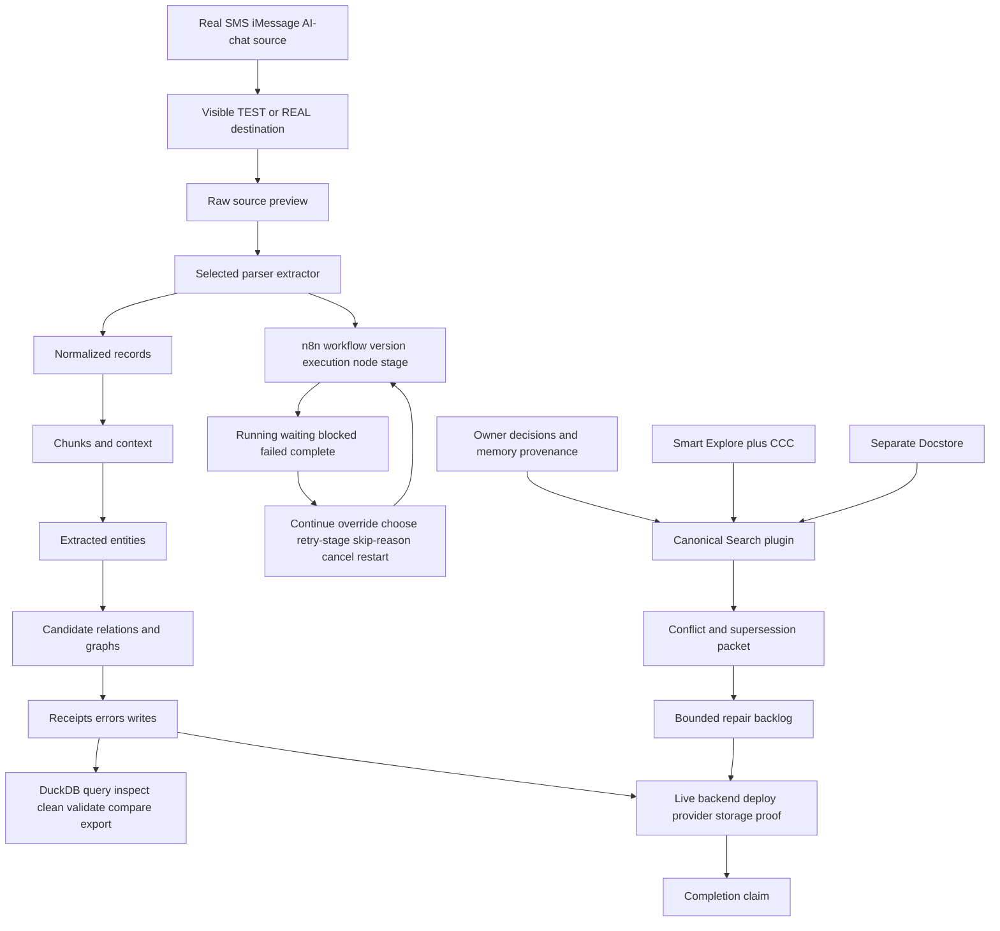

# Probata Product-Surface Acceptance and Search Reconciliation — 2026-09-13

This is a binding acceptance packet recovered from Codex, Claude, CNF, remember,
and memsearch records plus the current branch. The owner's anger about agents
calling handoffs complete while Git and the operator surface remained broken is
preserved as critical prioritization context: completion requires a usable,
observable end-to-end surface and live proof, not merely committed adapters,
types, tests, or handoff prose.

## Current classification

### Implemented in source, still lacking complete live proof

- Durable Proffer operation list/detail routes exist at
  `modules/workbench/api/app/runtime/proffer.py:148` and `:160`, backed by
  `service/proffer_operations.py`. The intake page renders
  `components/intake/proffer-operations-table.tsx`.
- Run continuation/abort/retry routes and optional retry-from-stage exist in
  `runtime/runs.py:186`, `service/runs.py:240`, `lib/api-client.ts:342`, and
  `components/runs/run-detail-dialog.tsx:218`.
- A source inspector and parser preflight exist in
  `service/source_inspection.py`; `unified-intake.tsx` exposes source, metadata,
  and parser tabs and shows recorded parser identity.
- Read-only normalized-source/chunk inspection exists in
  `service/knowledge.py:203`, `knowledge-item-drawer.tsx`, and
  `knowledge-browser.tsx`.
- Atomic monitored tools expose run/workflow IDs, retry count, and cancel in
  `components/tools/atomic-tools.tsx`.

These findings prove source paths and contracts only. They do not prove the
current deployed image, browser flow, real provider calls, real SMS/iMessage or
AI-chat ingestion, n8n execution, storage writes, or end-to-end usability.

### Missing or conflicting acceptance requirements

- The preview does not provide the complete required tab sequence: raw source;
  parsed/normalized records; chunks/context; extracted entities; candidate
  relations/graphs; receipts/errors; DuckDB result workspace.
- The current six checkpoint preview and message-oriented output do not expose
  every stage input/output, selected parser/extractor, run identity, progress,
  error cause, retry/write outcome, chunks, entities, or graph proposals.
- Blocked/failed work does not have one coherent path offering every valid
  action: continue, owner override, choose another extractor/parser, retry the
  exact stage, skip with reason, cancel, or restart from checkpoint. Existing
  run retry and monitored-action cancel are partial controls in separate views.
- No complete operator-surface integration was found for DuckDB query, inspect,
  clean, validate, compare, and export tools.
- n8n workflow/version/execution/node-stage visibility and valid control actions
  are absent from the proven surface.
- Development TEST matter versus REAL matter selection is not proven to persist
  through intake, preview handle, workflow, storage target, decisions, and
  promotion. The destination must be visible before execution and mode crossing
  must fail closed.
- The newest preview contract remains unproved with programmatic import through
  the actual process for real SMS/iMessage and AI-chat files, label testing, and
  the complete raw-to-normalized-to-chunks-to-entities-to-graph-candidates path.
  Browser/manual mocks, bypass tables, and ad-hoc scripts do not satisfy it.
- Existing UI labels and TypeScript response types may describe capabilities
  that lack matching backend, deployed-image, or live invocation proof.
- Search/index responses must always identify which project root, settings, and
  index answered. A zero-result or unverified call cannot be reported as success.
- Docstore flags that describe unavailable indexing execution are not proof that
  the capability exists. Documentation indexing and code indexing remain
  isolated applications.

## Required tool contract

The canonical `plugins/search` implementation directly exposes structural
Smart Explore, natural-language CCC code search, CCC refresh/status/doctor/grep,
eight selectable memory/document/code stores, conflict discovery, governing
contract retrieval, repair packets, status, and export. Docstore remains a
separate typed adapter with semantic search/retrieval, Surreal graph operations,
API resources, existence checks, freshness, attribution, and revision-exact
adjudication persistence.

## Acceptance graph

## Governing completion contract

A handoff is not complete while the owning Git state remains unreconciled, the
selected tool is not callable under its advertised name, the deployed path is
unverified, or the operator cannot see and control the real end-to-end run.
Every capability report must distinguish source implementation, tests, index
freshness, deployed image, live invocation, and real data-path proof.
