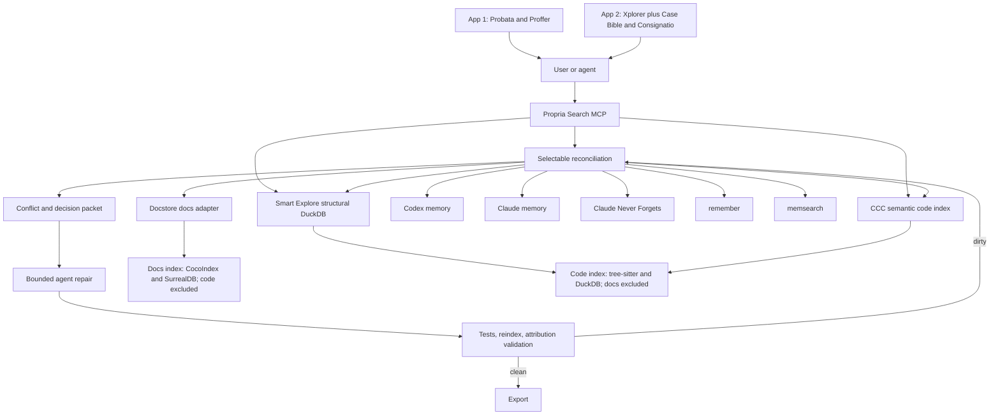

# Propria Search Plugin

This is the only canonical implementation of Smart Explore, CCC command exposure,
selectable memory recall, conflict discovery, and agent-driven reconciliation.
Documentation remains in the separate Docstore index. Smart Explore and CCC ingest
code only; reconciliation queries the isolated stores and preserves provenance.

## CLI

Run `search.cmd --help`. The launcher uses the plugin's locked `uv` project and
checks the explicit Windows `uv.exe` path before execution. Arbitrary system-Python
invocation of `smart_explore.py` is unsupported because it bypasses the declared
Tree-sitter and DuckDB runtime. Existing Smart Explore commands remain available:
`index`, `indexes`, `search`, `outline`, `unfold`, `refs`, `lsp`, `imports`,
`changed`, and safe `prune` quarantine.

Runtime indexes live only at
`E:\AI_Workspace\Projects\Propria\.runtime\search\smart-explore\indexes`.
The Propria root ignores `.runtime`, and database/WAL files must never be staged.
The plugin contains the engine; the runtime directory contains generated index
state only. A one-off `--db` is available for isolated diagnostics and tests.

Direct CCC commands are `semantic`, `ccc-index`, `ccc-status`, `ccc-doctor`, and
`ccc-grep`. Reconciliation commands are `stores`, `recall`, `conflicts`,
`decisions`, `reconcile run`, `reconcile repair`, `reconcile status`, and `export`.
Graph inspection commands are `graph-query` and `graph-preview`.
Every selectable-store response reports requested, available, queried, skipped,
error, adapter identity, duration, result count, and normalized result provenance.

Selectable stores: `smart_explore`, `ccc`, `docstore`, `codex_memory`,
`claude_memory`, `cnf`, `remember`, and `memsearch`. Modes: `auto`, `all`, and
`selected`. Selected mode requires an explicit nonempty store list.

Docstore is connected only through the JSON-stdio command named by
`PROPRIA_DOCSTORE_ADAPTER`; it never shares an index with code search.

## MCP tools

- `structural_search`
- `semantic_code_search`
- `code_index_refresh`
- `code_index_status`
- `code_index_doctor`
- `structural_grep`
- `store_inventory`
- `selected_store_recall`
- `conflict_discovery`
- `decisions_final_contracts`
- `reconcile_run`
- `reconcile_repair`
- `reconcile_status`
- `reconcile_graph_query`
- `reconcile_graph_preview`
- `reconcile_export`

## Tool graph

CCC identity is the resolved project root plus its `.cocoindex_code/settings.yml`
and `target_sqlite.db`. Smart Explore identity is resolved project root plus its
central DuckDB path. No invented application label replaces those identities.
